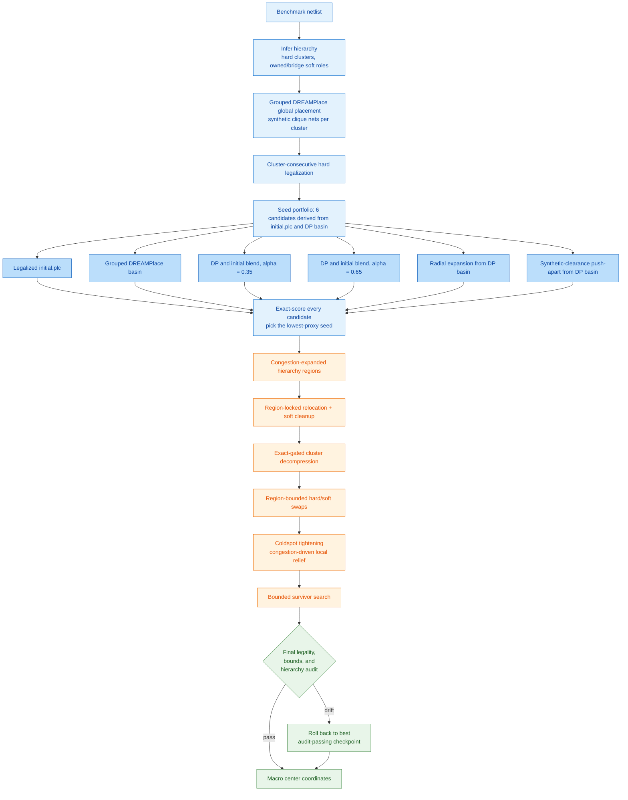

# VivaPlace: Hierarchy-Preserving Macro Placement

Macro placement is one of the hardest combinatorial problems in chip design.
A modern SoC netlist contains hundreds of hard macros (SRAMs, analog blocks,
hardened IP) and thousands of standard-cell clusters connected by tens of
thousands of nets, and the search space over their legal, non-overlapping
positions is exponential in macro count. A placement is judged not by one
number but by several that pull in different directions at once: wirelength
wants macros close together, congestion and density want them spread apart,
and routability wants clear keepout margins, grid-aligned spacing, and no
narrow notches between blocks. None of these proxies directly measures the
things that actually break chips downstream, IR drop, electromigration,
clock skew, but each one removes a structural condition that tends to cause
those failures once routing happens. Worse, a netlist also carries
hierarchical structure, RTL modules and their sub-blocks, that a purely
proxy-driven optimizer has no reason to respect: minimizing a flat wirelength
or congestion score can scatter a tightly-connected subsystem across the die
even though keeping it together would make the eventual physical design more
robust and easier to route, clock, and debug.

This repository is our submission to the [Partcl/HRT Macro Placement
Challenge](https://github.com/partcleda/macro-place-challenge-2026), built on
the ICCAD04 benchmark suite and the TILOS exact proxy evaluator. We treat
hierarchy preservation as the primary design objective rather than a side
effect of cost minimization. The placer infers a hierarchy model directly
from netlist connectivity, places it with a hierarchy-aware global solver
(DREAMPlace, seeded with synthetic clique nets per cluster), legalizes hard
macros in cluster-consecutive order, and then runs a sequence of
exact-proxy-gated local search passes, region-locked relocation, cluster
decompression, region-bounded swaps, and congestion-driven coldspot
tightening, that improve wirelength, density, and congestion while never
breaking the inferred hierarchy or the legality constraints the evaluator
enforces. The exact proxy still decides every accepted move; it is just no
longer the only thing the system is allowed to trade away.

Current full-suite result:

```text
uv run evaluate src/main.py --all
AVG 1.1999  17/17 VALID  0 overlaps  all hierarchy audits passed  (~1147s)
```

## Setup

```bash
git submodule update --init external/MacroPlacement
uv sync
uv pip install -r requirements.txt   # numba is required, not optional
```

## Commands

```bash
# Single benchmark - fastest feedback loop
uv run evaluate src/main.py -b ibm10

# Full IBM ICCAD04 suite
uv run evaluate src/main.py --all

# NG45 commercial designs (OpenROAD inputs)
uv run evaluate src/main.py --ng45

# Visualize a placement
uv run evaluate src/main.py -b ibm10 --vis

# Run the standard EDA flow (LEF/DEF/Verilog/SDC/Liberty in, DEF/Tcl/QoR out)
uv run python src/place_design.py \
  --lef tech.lef --lef macros.lef --def floorplan.def \
  --out-def placed.def --out-tcl place_macros.tcl --report qor.rpt
```

## How It Works



Blue nodes build the hierarchy-aware seed; the lighter blue row is the seed
portfolio — grouped DREAMPlace is one of six candidates, sitting next to
the legalized `initial.plc`, two DP/initial blends, a radial expansion of
the DP basin, and a synthetic-clearance push-apart of the DP basin. Every
candidate is exact-scored and only the lowest-proxy one advances. Orange
nodes are the exact-proxy-gated local search passes; green nodes are the
final audit and the rollback to the best audit-passing checkpoint if the
post-search state drifts too far from the selected seed.

The same flow, written as a linear pipeline:

```text
benchmark -> infer hierarchy (hard clusters, owned/bridge soft roles)
          -> grouped DREAMPlace global placement (synthetic clique nets)
          -> cluster-consecutive hard legalization
          -> seed portfolio: legalized initial.plc, DP basin,
             two DP/initial blends (alpha = 0.35, 0.65), radial
             expansion of DP basin, synthetic-clearance push-apart
          -> exact-score all candidates, advance the lowest-proxy seed
          -> congestion-expanded hierarchy regions
          -> region-locked relocation + soft cleanup
          -> exact-gated cluster decompression
          -> region-bounded hard/soft swaps
          -> coldspot tightening (congestion-driven local relief)
          -> bounded survivor search
          -> final legality, bounds, and hierarchy audit
          -> macro center coordinates
```

Every pass after the initial seed is gated by the exact proxy and, where
relevant, a hierarchy-quality budget: a candidate move is only accepted if it
improves the score without drifting too far from the placement's inferred
hierarchy. See [`docs/general/ARCHITECTURE.md`](docs/general/ARCHITECTURE.md)
for the full pipeline and [`docs/general/OBJECTIVES.md`](docs/general/OBJECTIVES.md)
for the structural objectives behind it.

## Source Layout

```text
src/main.py                evaluator-facing entrypoint
src/placer/pipeline/       hierarchy orchestration
src/placer/local_search/   cluster fields, relocation, swaps, coldspot, survivor search
src/placer/scoring/        exact and incremental proxy scoring
src/placer/routing/        routing demand and congestion helpers
src/placer/legalize/       hard-macro legalization
src/utils/                 runtime config and placement constants
src/dreamplace_bridge/     pb.txt <-> Bookshelf bridge and DREAMPlace launcher
src/eda_io/                LEF/DEF/Verilog/SDC/Liberty I/O layer
test/verification/         correctness checks
test/benchmarks/           synthetic anti-overfitting suite
docs/general/              architecture, design flow, objectives, experiment history
docs/ml_nn/                BeyondPPA structural metrics and GNN trace notes
```

## Documentation

- [`docs/general/ARCHITECTURE.md`](docs/general/ARCHITECTURE.md) - current pipeline and module reference
- [`docs/general/DESIGN_FLOW.md`](docs/general/DESIGN_FLOW.md) - flow diagram
- [`docs/general/OBJECTIVES.md`](docs/general/OBJECTIVES.md) - the structural objectives that motivate the design
- [`docs/general/ISSUES.md`](docs/general/ISSUES.md), [`docs/general/PROGRESS.md`](docs/general/PROGRESS.md) - experiment history; numbers there predate the hierarchy-only system and should not be read as current results
- [`docs/ml_nn/beyondppa_results/`](docs/ml_nn/beyondppa_results/) - BeyondPPA integration and GNN trace logging notes
