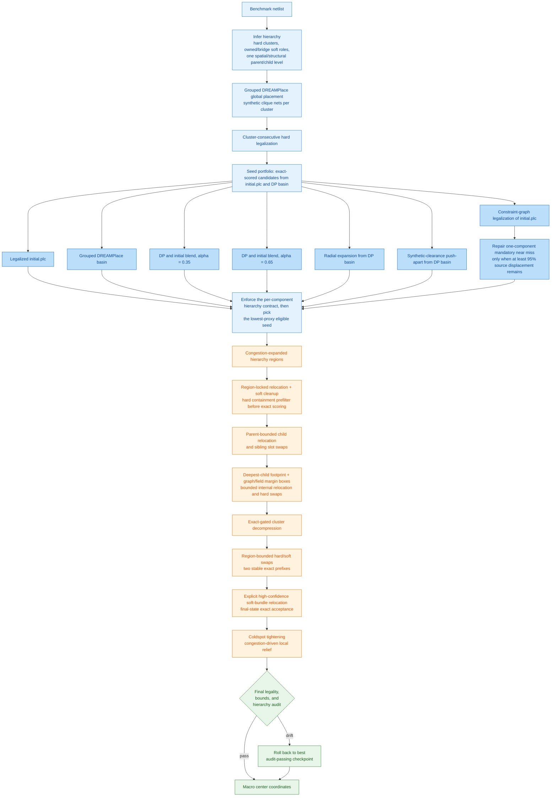

# VivaPlace: Hierarchy-Preserving Macro Placement

Macro placement is one of the hardest combinatorial problems in chip design.
A modern SoC netlist contains hundreds of hard macros (SRAMs, analog blocks,
hardened IP) and thousands of standard-cell clusters connected by tens of
thousands of nets, and the search space over their legal, non-overlapping
positions is exponential in macro count. A placement is judged not by one
number but by several that pull in different directions at once: wirelength
wants macros close together, congestion and density want them spread apart,
and routability wants clear keepout margins, grid-aligned spacing, and no
narrow notches between blocks. None of these proxies directly measures the
things that actually break chips downstream, IR drop, electromigration,
clock skew, but each one removes a structural condition that tends to cause
those failures once routing happens. Worse, a netlist also carries
hierarchical structure, RTL modules and their sub-blocks, that a purely
proxy-driven optimizer has no reason to respect: minimizing a flat wirelength
or congestion score can scatter a tightly-connected subsystem across the die
even though keeping it together would make the eventual physical design more
robust and easier to route, clock, and debug.

This repository is our submission to the [Partcl/HRT Macro Placement
Challenge](https://github.com/partcleda/macro-place-challenge-2026), built on
the ICCAD04 benchmark suite and the TILOS exact proxy evaluator. We treat
hierarchy preservation as the primary design objective rather than a side
effect of cost minimization. The placer infers a hierarchy model directly
from netlist connectivity, conservatively refining a nearly all-covering flat
component from shared hard-to-soft affinity when ordinary connectivity hides
its boundaries. It also retains one non-recursive parent/child level. When no
explicit or retained connectivity parent exists, direct/shared-soft structural
relations are reinforced by initial placement proximity, local macro density,
and placed wire pressure; proximity alone cannot declare an IP. Active leaf
clusters can then relocate or exchange slots inside a larger parent region
without changing the global DREAMPlace partition. Each deepest child also gets
a footprint-plus-margin relief box whose margin and cold-side expansion blend
congestion, density, and hierarchy-graph pressure. Individual members can
relocate or swap only inside that box. Region swaps exact-score two stable
prefixes and skip an untouched suffix only when either prefix already contains
the same first acceptable move. Disposable batched congestion grids are reduced
in place, and static hard-macro separation geometry is shared by every field
and round in one swap schedule. The model is placed with a
hierarchy-aware global solver
(DREAMPlace, seeded with synthetic clique nets per cluster), legalizes hard
macros in cluster-consecutive order, and then runs a sequence of
exact-proxy-gated local search passes, region-locked relocation, cluster
decompression, region-bounded swaps, and congestion-driven coldspot
tightening, that improve wirelength, density, and congestion while never
breaking the inferred hierarchy or the legality constraints the evaluator
enforces. The exact proxy still decides every accepted move; it is just no
longer the only thing the system is allowed to trade away.

Current full-suite result:

```text
uv run evaluate src/main.py --all
AVG 1.1404  17/17 VALID  0 overlaps  all hierarchy audits passed  (318.55s)

uv run evaluate src/main.py --ng45
AVG 0.7121  4/4 VALID  0 overlaps  all hierarchy audits passed  (64.80s)
```

Sixteen IBM scores remain bit-identical to the accepted reference. A
contract-preserving near-miss repair retained 99.61% of the IBM09 constraint-
graph seed displacement and improved that design from `1.0122` to `0.9978`.
Stable-prefix swap scoring, ranked-only hard legality, and disabled-graph
allocation removal now avoid 66,703 exact evaluations and reduce attributed
region-swap time from 159.91s to 148.29s. In-place congestion-tail reduction
and schedule-scoped hard-geometry reuse reduce it again to 146.98s while
preserving all placements and exact-score counts. Direct global-topology swap
routing then removes pair-specific topology construction, while exact sparse
congestion/density reducers merge only changed cells with the cached baseline
tail. Attributed region-swap time falls again to 104.04s with the same
1,077,431 physical and 66,703 avoided exact scores; complete IBM runtime falls
to 351.48s.
A commit-scoped cache now reuses the sorted congestion/density baseline and
density summary across rejected swap batches, rebuilding it only after a
committed scorer-state change. The verification sweep preserved every IBM
placement/count and reduced attributed region-swap time again from 104.04s to
102.68s; focused IBM04/12/18 reductions were 7.6%, 9.3%, and 5.5%. NG45 kept
AVG 0.7121 while its region phase fell from 15.41s to 14.62s. Candidate-row
parallelism and a fused hard-blockage scratch were benchmarked and reverted
because they were slower.
The current swap scheduler tests a second same-sized stable prefix before the
untouched suffix, increasing avoided exact evaluations from 66,703 to 79,466
and reducing trace-compatible region-swap time from 104.04s to 98.74s. Batched
soft wirelength prefiltering rejects 100,831 proposals before congestion and
density scoring, cutting the four main soft-relocation phases by 20.7–22.3%.
Mutually exclusive telemetry accounts for at least 99.86% of every IBM placer
call: 297.33s was inside `MacroPlacer.place()` and the remaining 21.22s of the
318.55s command was evaluator loading/final scoring.
The independent synthetic hierarchy suite is 10/10 valid with zero overlaps,
10/10 truth-audit passes, and `AVG 1.4192`.

## Setup

```bash
git submodule update --init external/MacroPlacement
uv sync
uv pip install -r requirements.txt   # numba is required, not optional
# Required on a clean checkout: pinned DREAMPlace source/toolchain/build.
scripts/dreamplace/bootstrap.sh all
# Fast diagnosis for an existing build (native extensions and Python ABI).
scripts/dreamplace/bootstrap.sh preflight
```

## Commands

```bash
# Single benchmark - fastest feedback loop
uv run evaluate src/main.py -b ibm10

# Full IBM ICCAD04 suite
uv run evaluate src/main.py --all

# NG45 commercial designs (OpenROAD inputs)
uv run evaluate src/main.py --ng45

# Contract headroom and counterfactual slack calibration
uv run python scripts/analyze_hierarchy_contract.py \
  ml_data/plateau_telemetry/plateau_telemetry.jsonl

# Reconcile exclusive placer phases against the API boundary
uv run python scripts/analyze_plateau_telemetry.py \
  ml_data/plateau_telemetry/plateau_telemetry.jsonl --coverage

# Visualize a placement
uv run evaluate src/main.py -b ibm10 --vis

# Run the standard EDA flow (LEF/DEF/Verilog/SDC/Liberty in, DEF/Tcl/QoR out)
uv run python src/place_design.py \
  --lef tech.lef --lef macros.lef --def floorplan.def \
  --out-def placed.def --out-tcl place_macros.tcl --report qor.rpt
```

## How It Works



Blue nodes build the hierarchy-aware seed; the lighter blue row is the seed
portfolio — grouped DREAMPlace sits next to
the legalized `initial.plc`, two DP/initial blends, a radial expansion of
the DP basin, a synthetic-clearance push-apart of the DP basin, and a
constraint-graph legalization of `initial.plc`. A mandatory lower-proxy seed
that misses exactly one component may be projected toward the passing reference;
the repaired state advances to exact scoring only when it is legal and retains
at least 95% of the source displacement. Production legalizes
`initial.plc` before it builds the reference limits. Non-mandatory candidates
that already fail immutable hard components are removed before exact scoring;
the remaining candidates are checked component-by-component and only the
lowest-proxy eligible one advances. The six-part
hard/soft/graph hierarchy vector covers cluster compactness, worst spread,
nearest-neighbor impurity, hierarchy-edge stretch, owned-soft distance, and
bridge-soft corridor distance. An experimental
hierarchy-first selector is available through `HIER_SEED_HIERARCHY_SELECT=1`,
but remains default-off because focused validation materially regressed proxy.
For single-component affinity refinement, an already legal raw `initial.plc`
can remain the immutable reference when its legalized form satisfies the raw
limits, preventing double slack. If the raw hard placement is illegal, grouped
DREAMPlace is the reference instead. This keeps seedless/random input from
defining false hierarchy geometry while preserving the exact contract and
final rollback gates.
Orange
nodes are the exact-proxy-gated local search passes; green nodes are the
final audit and the rollback to the best audit-passing checkpoint if either
the legacy hard-cluster quality or any hierarchy-vector component drifts too
far from the selected seed.

The same flow, written as a linear pipeline:

```text
benchmark -> infer hierarchy (hard clusters, owned/bridge soft roles)
          -> grouped DREAMPlace global placement (synthetic clique nets)
          -> cluster-consecutive hard legalization
          -> seed portfolio: legalized initial.plc, DP basin,
             two DP/initial blends (alpha = 0.35, 0.65), radial
             expansion of DP basin, synthetic-clearance push-apart,
             constraint-graph legalized initial.plc
          -> exact-score all candidates, apply the per-component hierarchy
             contract relative to the topology-appropriate legal reference,
             and advance the lowest-proxy eligible seed
          -> congestion-expanded hierarchy regions
          -> region-locked relocation + soft cleanup; reject hard candidates
             above the selected seed's containment limit before exact scoring
          -> parent-bounded child relocation and sibling slot swaps
          -> build immutable deepest-child footprint-plus-margin boxes from
             congestion, density, and graph pressure; run bounded internal
             hard/owned-soft relocation and hard-hard swaps
          -> exact-gated cluster decompression
          -> region-bounded hard/soft swaps with two stable exact prefixes
          -> hierarchy-bounded explicit high-confidence soft-bundle relocation;
             exact-score only after the complete group move is formed
          -> coldspot tightening (congestion-driven local relief)
          -> final legality, bounds, hard-cluster audit, and per-component
             hierarchy-vector audit
          -> macro center coordinates
```

Every pass after the initial seed is gated by the exact proxy and, where
relevant, a hierarchy-quality budget: a candidate move is only accepted if it
improves the score without drifting too far from the placement's inferred
hierarchy. See [`docs/general/ARCHITECTURE.md`](docs/general/ARCHITECTURE.md)
for the full pipeline and [`docs/general/OBJECTIVES.md`](docs/general/OBJECTIVES.md)
for the structural objectives behind it.

## Source Layout

```text
src/main.py                evaluator-facing entrypoint
src/placer/pipeline/       hierarchy orchestration
src/placer/local_search/   hierarchy metrics, relocation, swaps, and coldspot search
src/placer/scoring/        exact and incremental proxy scoring
src/placer/routing/        routing demand and congestion helpers
src/placer/legalize/       hard-macro legalization
src/utils/                 runtime config and placement constants
src/dreamplace_bridge/     pb.txt <-> Bookshelf bridge and DREAMPlace launcher
src/eda_io/                LEF/DEF/Verilog/SDC/Liberty I/O layer
test/verification/         correctness checks
test/benchmarks/           synthetic anti-overfitting suite
docs/general/              architecture, design flow, objectives, issues, experiment ledger
```

## Documentation

- [`docs/general/ARCHITECTURE.md`](docs/general/ARCHITECTURE.md) - current pipeline and module reference
- [`docs/general/DESIGN_FLOW.md`](docs/general/DESIGN_FLOW.md) - flow diagram
- [`docs/general/OBJECTIVES.md`](docs/general/OBJECTIVES.md) - the structural objectives that motivate the design
- [`docs/general/REFERENCES.md`](docs/general/REFERENCES.md) - research papers, technical sources, and external dependency links
- [`docs/general/ISSUES.md`](docs/general/ISSUES.md) - current unresolved work
- [`docs/general/PROGRESS.md`](docs/general/PROGRESS.md) - chronological experiment ledger; only its first status entry describes current production
