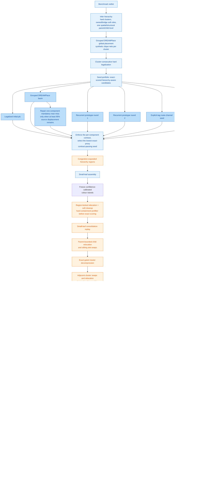

# VivaPlace: Hierarchy-Preserving Macro Placement

Macro placement is one of the hardest combinatorial problems in chip design.
A modern SoC netlist contains hundreds of hard macros (SRAMs, analog blocks,
hardened IP) and thousands of standard-cell clusters connected by tens of
thousands of nets, and the search space over their legal, non-overlapping
positions is exponential in macro count. A placement is judged not by one
number but by several that pull in different directions at once: wirelength
wants macros close together, congestion and density want them spread apart,
and routability wants clear keepout margins, grid-aligned spacing, and no
narrow notches between blocks. None of these proxies directly measures the
things that actually break chips downstream, IR drop, electromigration,
clock skew, but each one removes a structural condition that tends to cause
those failures once routing happens. Worse, a netlist also carries
hierarchical structure, RTL modules and their sub-blocks, that a purely
proxy-driven optimizer has no reason to respect: minimizing a flat wirelength
or congestion score can scatter a tightly-connected subsystem across the die
even though keeping it together would make the eventual physical design more
robust and easier to route, clock, and debug.

This repository is our submission to the [Partcl/HRT Macro Placement
Challenge](https://github.com/partcleda/macro-place-challenge-2026), built on
the ICCAD04 benchmark suite and the TILOS exact proxy evaluator. We treat
exact proxy cost as the optimization objective, subject to legality and
hierarchy preservation. Extra hierarchy compactness or headroom cannot justify
a higher-cost seed, and final envelope isolation is removed. The placer infers
a hierarchy model directly from netlist connectivity, conservatively refining a nearly all-covering flat
component from shared hard-to-soft affinity when ordinary connectivity hides
its boundaries. It also retains one non-recursive parent/child level. When no
explicit or retained connectivity parent exists, direct/shared-soft structural
relations are reinforced by initial placement proximity, local macro density,
and placed wire pressure; proximity alone cannot declare an IP. Active leaf
clusters can then relocate or exchange slots inside a larger parent region
without changing the global DREAMPlace partition. Region swaps exact-score two stable
prefixes and skip an untouched suffix only when either prefix already contains
the same first acceptable move. Disposable batched congestion grids are reduced
in place, and static hard-macro separation geometry is shared by every field
and round in one swap schedule. The model is placed with a
hierarchy-aware global solver
(DREAMPlace, seeded with synthetic clique nets per cluster), legalizes hard
macros in cluster-consecutive order, and then runs a sequence of
exact-proxy-gated local search passes, region-locked relocation, cluster
decompression, transactional graph-adjacent ownership transfer, region-bounded
swaps, and congestion-driven coldspot
tightening. A final graph-directed survivor can place a complete small leaf and
its owned soft macros into density-safe gaps between large hard macros. It also
tests hard-clear canvas-edge pockets with stable residual soft bundles,
pass-local routing cohorts, and residual singleton soft macros. These
passes improve wirelength, density, and congestion while preserving the dynamic
hierarchy contract and the legality constraints the evaluator enforces.
Exact proxy decides accepted moves within those constraints. After checkpoint
selection, a bounded density pass can move free soft macros while freezing
every hard macro, hierarchy role, and soft bundle. It verifies the proposed
float32 output through the same bounds clamp used by the API return.
The following cluster-tile search attributes directional congestion and density
pressure to complete incident nets, then jointly rearranges small connected
groups within one leaf/child partition. Ownership stays fixed, explicit soft
bundles move rigidly, and only a fresh exact gain passing the existing hierarchy
and legality gates can survive. Search is capped at 64 trials and three seconds
of unused late-pass allowance.

The current cluster-tile same-input replay improves **4/31 designs**, leaves
**27 unchanged**, and passes every hierarchy, legality, and independent tag/truth
check. The deepest-child internal search was removed after its isolated
31-design ablation preserved all coordinates and hierarchy metrics. See [PROGRESS.md](docs/PROGRESS.md) for paired controls
and the distinction between fixed-work and ordinary timed results.

The ordinary-guard run returns exactly the same 31 placements as the
independently audited replay. Its evaluator headline means are IBM
**1.181128351**, NG45 **0.717060223**, and synthetic **1.436273508**. Earlier
score histories and timing controls are in [PROGRESS.md](docs/PROGRESS.md) and
[the algorithm review](ml_data/algorithm_review/20260909/results.md).

`MacroPlacer` accepts keyword-only `seed`, `event_sink`, and
`dreamplace_sample_every` options. The unused restart/noise settings and overall
`time_budget_s` option are removed. VivaPlace uses per-pass time limits and
exact-score quotas; `src/place_design.py` no longer advertises the ignored
`--budget` flag.

## Setup

```bash
git submodule update --init external/MacroPlacement
uv sync
uv pip install -r requirements.txt   # numba is required, not optional
# Required on a clean checkout: pinned DREAMPlace source/toolchain/build.
scripts/dreamplace/bootstrap.sh all
# Verify source patches, runtime parity, pinned packages, and native ABI.
scripts/dreamplace/bootstrap.sh preflight
```

The bootstrap reproduces the configured runtime using tracked source patches,
an exact Linux toolchain lock, and pinned Python dependencies. See
[SETUP.md](SETUP.md) for prerequisites and isolated build directories.

## Commands

Placement and diagnostic configuration uses `src/utils/constants.py`; environment
overrides are ignored. CPU DREAMPlace and the existing search quotas remain the
defaults. Diagnostic CLIs set constants directly for their isolated runs.
Rejected GPU overlap, graph-construction/affinity, and RUDY seed experiments are
retired. The CPU split study and GPU soft-refinement replay remain offline;
fresh replay inputs use `run_dreamplace_cuda_comparison.py --capture-final`.

```bash
# Single benchmark - fastest feedback loop
uv run evaluate src/main.py -b ibm10

# Experimental CUDA seeds: first set DREAMPLACE_GPU = True in src/utils/constants.py
uv run evaluate src/main.py -b ibm10

# Full IBM ICCAD04 suite
uv run evaluate src/main.py --all

# NG45 commercial designs (OpenROAD inputs)
uv run evaluate src/main.py --ng45

# Contract headroom and counterfactual slack calibration
uv run python scripts/analyze_hierarchy_contract.py \
  ml_data/plateau_telemetry/plateau_telemetry.jsonl

# Reconcile exclusive placer phases against the API boundary
uv run python scripts/analyze_plateau_telemetry.py \
  ml_data/plateau_telemetry/plateau_telemetry.jsonl --coverage

# Visualize a placement
uv run evaluate src/main.py -b ibm10 --vis

# Live accepted-move dashboard (optional Qt dependencies)
uv run --extra visualizer python src/visualizer/main.py --benchmark ibm10

# Evaluator-parity dashboard using the ordinary cached DREAMPlace seed
uv run --extra visualizer python src/visualizer/main.py \
  --benchmark ibm10 --use-dreamplace-cache

# Generated/custom design directory; initial.plc is optional
uv run --extra visualizer python src/visualizer/main.py \
  --benchmark-dir test/benchmarks/testcases/syn01_wide

# Replay a completed or partially written live trace
uv run --extra visualizer python src/visualizer/main.py \
  --replay ml_data/visualizer/ibm10

# Export that replay as a shareable H.264 MP4 at 10× slower speed
uv run --extra visualizer python src/visualizer/main.py \
  --replay ml_data/visualizer/ibm10 \
  --export-mp4 vivaplace-ibm10.mp4 --export-speed 0.1

# Run the standard EDA flow (LEF/DEF/Verilog/SDC/Liberty in, DEF/Tcl/QoR out)
uv run python src/place_design.py \
  --lef tech.lef --lef macros.lef --def floorplan.def \
  --out-def placed.def --out-tcl place_macros.tcl --report qor.rpt
```

Live visualization is a research diagnostic, not a runtime benchmark. It
bypasses the DREAMPlace final-position cache so optimizer motion is observable;
ordinary evaluator commands retain the production cache and Qt-free execution
path. See the [visualizer guide](src/visualizer/README.md) for controls, trace
semantics, MP4 export, custom output paths, and overhead details.

## How It Works


```mermaid
flowchart TD
    A[Benchmark netlist] --> B[Infer hierarchy<br/>hard clusters, owned/bridge soft roles,<br/>one spatial/structural parent/child level]
    B --> C[Grouped DREAMPlace global placement<br/>synthetic clique nets per cluster]
    C --> D[Cluster-consecutive hard legalization]

    D --> P[Seed portfolio: exact-scored hierarchy-aware candidates]
    P --> S0[Legalized initial.plc]
    P --> S1[Grouped DREAMPlace basin]
    P --> S2[Recurrent prototype round 1]
    P --> S3[Recurrent prototype round 2]
    P --> S4[Explicit-tag route-channel seed]
    P --> S5[Conditional initial-anchored recurrent repair]
    S0 --> E[Enforce the per-component contract,<br/>select the lowest exact-proxy<br/>contract-passing seed]
    S1 --> E
    S2 --> E
    S3 --> E
    S4 --> E
    S5 --> E
    S1 --> S7[Repair one-component mandatory near miss<br/>only when at least 95% source displacement remains]
    S7 --> E

    E --> F[Congestion-expanded hierarchy regions]
    F --> F0[Small-leaf assembly]
    F0 --> F2[Freeze confidence-calibrated<br/>colour islands]
    F2 --> G[Region-locked relocation + soft cleanup<br/>hard containment prefilter before exact scoring]
    G --> G1[Small-leaf consolidation replay]
    G1 --> G2[Parent-bounded child relocation<br/>and sibling slot swaps]
    G2 --> H[Exact-gated cluster decompression]
    H --> H1[Adjacent-cluster swaps and relocation<br/>transactional ownership transfer + same-leaf repair]
    H1 --> I[Region-bounded hard/soft swaps<br/>two stable exact prefixes]
    I --> I2[Explicit high-confidence soft-bundle relocation<br/>final-state exact acceptance]
    I2 --> J[Coldspot tightening<br/>congestion-driven local relief]
    J --> K[Topology-aware leaf survivor floorplanning:<br/>internal adjacency, boundary ports,<br/>owned-soft barycentres]
    K --> V[Whole-leaf void relocation<br/>and boundary expansion]
    V --> L{Final legality,<br/>bounds, and<br/>hierarchy audit}
    L -->|pass| Q[Bounded free-soft density relief]
    L -->|drift| N[Roll back to best<br/>audit-passing checkpoint]
    N --> Q
    Q --> R[Joint cluster-tile rearrangement<br/>fresh float32 exact + complete hierarchy gate]
    R --> M[Macro center coordinates]

    classDef seed fill:#e3f2fd,stroke:#1976d2,color:#0d47a1
    classDef cand fill:#bbdefb,stroke:#1565c0,color:#0d47a1
    classDef search fill:#fff3e0,stroke:#ef6c00,color:#e65100
    classDef audit fill:#e8f5e9,stroke:#2e7d32,color:#1b5e20
    class A,B,C,D,P,E,F0 seed
    class S0,S1,S2,S3,S4,S5,S7 cand
    class F,G,G1,G2,H,H1,I,I2,J,K,V,Q,R search
    class L,M,N audit
```

Blue nodes build the hierarchy-aware seed; the lighter blue row is the seed
portfolio — grouped DREAMPlace sits next to
two bounded Re²MaP-inspired recurrent prototypes, the legalized `initial.plc`,
a conditional initial-anchored recurrent repair,
and, for explicit path-tag designs, a cluster-local route-channel seed. A mandatory lower-proxy seed
that misses exactly one component may be projected toward the passing reference;
the repaired state advances to exact scoring only when it is legal and retains
at least 95% of the source displacement. Production legalizes
`initial.plc` before it builds the reference limits. Non-mandatory candidates
that already fail immutable hard components are removed before exact scoring;
the remaining candidates are checked component-by-component; production selects
the lowest exact proxy among passing candidates. The six-part
hard/soft/graph hierarchy vector covers cluster compactness, worst spread,
nearest-neighbor impurity, hierarchy-edge stretch, owned-soft distance, and
bridge-soft corridor distance. Hierarchy quality and headroom are diagnostics
once the contract passes; their former ranking modes are removed.
For single-component affinity refinement, an already legal raw `initial.plc`
can remain the immutable reference when its legalized form satisfies the raw
limits, preventing double slack. If the raw hard placement is illegal, grouped
DREAMPlace is the reference instead. This keeps seedless/random input from
defining false hierarchy geometry while preserving the exact contract and
final rollback gates.
Orange
nodes are the exact-proxy-gated local search passes; green nodes are the
final audit and the rollback to the best audit-passing checkpoint if either
the legacy hard-cluster quality or any hierarchy-vector component drifts too
far from the selected seed.

The same flow, written as a linear pipeline:

```text
benchmark -> infer hierarchy (hard clusters, owned/bridge soft roles)
          -> grouped DREAMPlace global placement (synthetic clique nets)
          -> cluster-consecutive hard legalization
          -> seed portfolio: legalized initial.plc, grouped DP basin,
             two recurrent hierarchy prototypes, a conditional initial-anchored
             recurrent repair, and an explicit-tag-only route-channel candidate
          -> exact-score all candidates, apply the per-component hierarchy
             contract relative to the topology-appropriate legal reference,
             then select the lowest exact proxy with stable candidate-name tie-breaking
          -> congestion-expanded hierarchy regions
          -> compact ordinary small leaves
          -> freeze confidence-calibrated
             per-colour hard/owned-soft island boxes and leaf-specific limits
          -> region-locked relocation + soft cleanup; reject hard candidates
             above the selected seed's containment limit before exact scoring
          -> small-leaf consolidation replay
          -> parent-bounded child relocation and sibling slot swaps
          -> exact-gated cluster decompression
          -> derive live frontier, cut, capacity, heat, routing-attribution,
             and boundary-pressure state from the persistent hierarchy-ID graph
          -> graph-adjacent hard/soft swaps, single relocation, and connected
             frontier-bundle migration; commit dynamic
             ownership only after exact proxy, density/congestion, and complete
             hierarchy gates, rebuild capacity-directed regions, then repair
             inside the updated leaves
          -> region-bounded hard/soft swaps with two stable exact prefixes
          -> hierarchy-bounded explicit high-confidence soft-bundle relocation;
             exact-score only after the complete group move is formed
          -> coldspot tightening (congestion-driven local relief)
          -> topology-aware internal leaf survivor floorplanning: keep connected
             hard macros adjacent, put external-demand macros on facing boundary
             ports with routing-channel insets, and move owned softs toward
             hard-affinity barycentres inside the frozen islands
          -> exact-gated void relocation and boundary expansion
          -> final legality, bounds, hard-cluster audit, and per-component
             hierarchy-vector plus per-colour island audit using graph-derived
             boundary-to-interior legalization order
          -> bounded free-soft density relief, freezing every hierarchy role
          -> bounded joint cluster-tile rearrangement inside one leaf/child;
             fresh float32 exact gain and complete hierarchy/legality gates
          -> macro center coordinates
```

The hierarchy model and persistent location graph share one canonical active
leaf-edge list. Macro adjacency is a cached traversal projection of the same
immutable pin/net topology; retained child and parent edges are separate
hierarchy-level projections. Hard ownership changes rebuild active edges from
cached nets with the original full-net weighting, while soft-only ownership
changes leave the hard hierarchy graph unchanged.

Every pass after the initial seed is gated by the exact proxy and, where
relevant, a hierarchy-quality budget: a candidate move is only accepted if it
improves the score without drifting too far from the placement's inferred
hierarchy. See [`docs/ARCHITECTURE.md`](docs/ARCHITECTURE.md)
for the full pipeline and [`docs/OBJECTIVES.md`](docs/OBJECTIVES.md)
for the structural objectives behind it.

## Source Layout

```text
src/main.py                evaluator-facing entrypoint
src/placer/pipeline/       hierarchy orchestration
src/placer/local_search/   hierarchy metrics, relocation, swaps, and coldspot search
src/placer/scoring/        exact and incremental proxy scoring
src/placer/routing/        routing demand and congestion helpers
src/placer/legalize/       hard-macro legalization
src/utils/                 runtime config and placement constants
src/dreamplace_bridge/     pb.txt <-> Bookshelf bridge and DREAMPlace launcher
src/eda_io/                LEF/DEF/Verilog/SDC/Liberty I/O layer
test/verification/         correctness checks
test/benchmarks/           synthetic anti-overfitting suite
docs/                      architecture, design flow, objectives, issues, experiment ledger
src/visualizer/            opt-in live dashboard, event schema, traces, and replay
```

## Documentation

- [`docs/ARCHITECTURE.md`](docs/ARCHITECTURE.md) - current pipeline and module reference
- [`docs/DESIGN_FLOW.md`](docs/DESIGN_FLOW.md) - flow diagram
- [`docs/OBJECTIVES.md`](docs/OBJECTIVES.md) - the structural objectives that motivate the design
- [`docs/REFERENCES.md`](docs/REFERENCES.md) - research papers, technical sources, and external dependency links
- [`docs/ISSUES.md`](docs/ISSUES.md) - current unresolved work
- [`docs/PROGRESS.md`](docs/PROGRESS.md) - chronological experiment ledger; only its first status entry describes current production
- [`src/visualizer/README.md`](src/visualizer/README.md) - live dashboard commands, controls, events, and trace format
