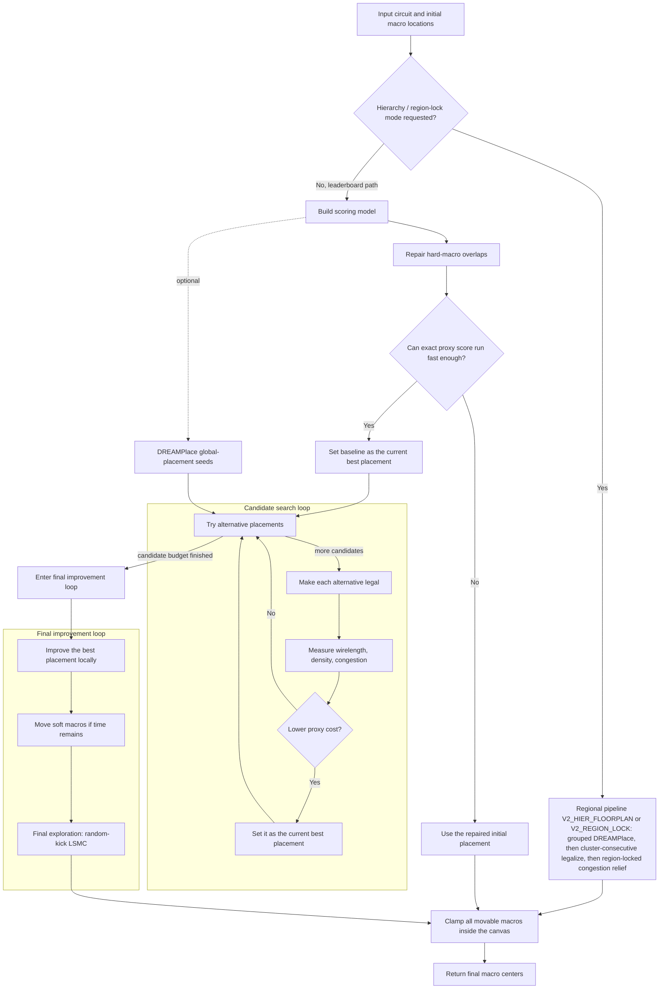

# v2 Design Flow

This document describes the production flow implemented by
`src/placer/pipeline/macro_placer.py`.

## TLDR

`MacroPlacer.place()` is a budget-gated, accept-only search over macro
placements. It legalizes the benchmark's initial hard macro positions, launches
three standard DREAMPlace subprocesses as asynchronous candidate generators when
the bridge is available, explores generic random/local restart candidates, runs
a deep R2 local-search finisher, and uses LSMC as the final global exploration
layer.

Every candidate that can affect the incumbent is judged by the exact proxy:

```text
proxy = wirelength + 0.5 * density + 0.5 * congestion
```

`best_pl` and `best_score` are the main incumbent state. They update only when
an exact proxy score is lower.

## Flow



## Active Candidate Sources

- **Baseline:** legalize hard macros from `initial.plc`.
- **DREAMPlace:** when available, three async DP variants are scored as ordinary
  candidates. They may update `best_pl`, but they are not retained as special
  LSMC seed basins.
- **Random restarts:** Gaussian perturbations of initial hard positions,
  legalized and exact-scored.
- **Random-order legalization:** three alternate legalizer tie-break orders from
  the initial placement.
- **R2:** the main local-search finisher.
- **Post-R2 soft relocation:** short leftover-budget soft cleanup.
- **LSMC:** final generic multi-incumbent exploration over baseline/random/P9/
  pre-R2/post-R2 seeds.

## Important Details

- Hard and soft macro labels come from the benchmark API. The placer does not
  infer them.
- Congestion-gradient phases are no longer part of the active flow. Historical
  notes may mention phases 1/2/3/5b/5c/7/8; those labels refer to retired
  experiments.
- Non-DREAMPlace candidates leave soft macro positions as they are in the source
  placement until R2/post-R2/LSMC soft moves operate on them. DREAMPlace
  candidates can carry DREAMPlace-produced soft positions.
- Random-noise and random-order phases restart from the initial hard positions,
  not from `best_pl`.
- LSMC seed collection is intentionally generic. It does not use
  DREAMPlace/bridge-specific seed pools and does not use cong-grad-derived
  state.
- R2 is richer than "relocation plus 2-opt": each round can run hard relocation,
  soft relocation, soft-soft swaps, hard-soft swaps, hard-soft-soft 3-cycles, and
  hard 2-opt cleanup.
- By default, `src/main.py` enables the shipped hard-relocation ML filter when no
  `ML_*` env var is preset and the model artifact plus `xgboost` are available.
  It widens the hard-relocation pool to 32 and exact-scores the ranked top 16;
  any preset `ML_*` var, missing model, or missing `xgboost` falls back to the
  pure-heuristic path.
- `V2_RELOC_PROPOSE_ALL=auto` can enable the CUDA propose-all hard-relocation
  ranking path only when the runtime backend is CUDA. It is an opt-in search
  variant; exact incremental scoring still gates every committed move.
- `V2_GPU_EXPLORE=auto` enables the final LSMC layer when CUDA is visible.
  `V2_GPU_EXPLORE_MULTI_INCUMBENT`, `V2_GPU_EXPLORE_MAX_SEEDS`, and
  `V2_GPU_EXPLORE_SEED_MARGIN` control the generic seed pool. The LSMC kick is a
  random per-macro kick; a cluster-coherent kick variant was tested and removed
  as noise (ISSUES.md S20).
- Every return path passes through a final in-bounds clamp for movable macros.
  Hard macros are already legalized by the normal path; the clamp mainly protects
  against soft macro coordinates inherited from input data or DREAMPlace output.

## Alternate path: hierarchy-floorplan / region-lock mode (opt-in, non-proxy)

The flow above optimizes the proxy, which **rewards spreading** connected macros
apart. When the goal is instead to keep connected subsystems together (a
hierarchical floorplan), `place()` short-circuits at entry into a separate
regional pipeline (`_hierarchy_floorplan`). It is **off by default and never
touches the leaderboard path**; enable with `V2_HIER_FLOORPLAN=1` (explicit
non-proxy deliverable) or `V2_REGION_LOCK=1` (the production output should be
region-locked) — both route here.

This path trades proxy for hierarchy by design:

1. Derive connectivity clusters (subsystems) and the soft macros each one drives.
2. Run grouped DREAMPlace (synthetic per-cluster clique nets) so each subsystem
   is pulled together in global placement.
3. Legalize with cluster members placed back-to-back, so each subsystem keeps
   its region instead of being scattered by the default legalize order.
4. **Region-locked congestion relief** (`V2_HIER_REGION_RELIEF`, default on
   here): move hard macros to less-congested cells *within their own cluster
   region only* (a soft fence), then clean up soft macros. This lowers
   congestion while keeping connected macros close — e.g. ibm10 proxy
   1.82→1.68 with cluster closeness essentially preserved. The lock↔relief
   tradeoff is tuned by `V2_HIER_REGION_DENSITY` (higher = tighter regions).

Region-locking is confined to this dedicated pipeline because region-biasing the
*main* flow's relocation alone is overridden by its spread-oriented phases
(DREAMPlace candidates, noise restarts, LSMC kicks). See ARCHITECTURE.md §5.9
and ISSUES.md S20.

## Entry points

The flow above starts from a `Benchmark`. There are two ways to produce one:

- **Challenge path** — the harness calls `load_benchmark` on an ICCAD04
  `netlist.pb.txt` + `initial.plc` pair (the 17 IBM benchmarks, NG45, and the
  synthetic suite under `test/benchmarks/`).
- **eda_io path** — `src/place_design.py` accepts standard EDA inputs
  (LEF / DEF / structural Verilog / SDC / Liberty), merges them into a neutral
  `Design`, converts to the same ICCAD04 pair, and loads it through the same
  `load_benchmark`. The flow in this document then runs completely unchanged,
  including exact PLC proxy scoring. Results are written back out as an
  updated DEF, ICC2/Innovus Tcl, and/or a QoR report. See
  `src/eda_io/README.md`.
