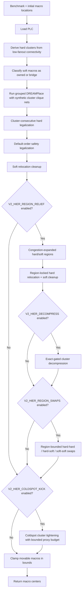

# v2 Design Flow

This document describes the current production flow implemented by
`src/placer/pipeline/macro_placer.py`.

## Current Mode

`MacroPlacer.place()` is hierarchy-only. It no longer branches between a
leaderboard/proxy path and a hierarchy path. If grouped DREAMPlace is unavailable,
the placer raises:

```text
hierarchy floorplan path unavailable; proxy fallback has been removed
```

The deleted proxy path included random candidate restarts, R2/2-opt/swap/cycle
search, generic LSMC exploration, generic cluster kicks, CUDA propose-all
integration in the main loop, and ML ranker defaults.

Current accepted result:

```text
uv run evaluate src/main.py -b ibm10
proxy=1.6759  VALID

uv run evaluate src/main.py --all
AVG 1.4452  17/17 VALID  0 overlaps  520.08s
```

## Flow



## Cluster Derivation

Clusters are inferred from the flat ICCAD04-style netlist. The benchmarks do
not provide hierarchy directly, and direct hard-to-hard nets are sparse, so the
cluster builder uses low-fanout connectivity through soft macros.

Controls:

```text
V2_CLUSTER_MAX_FANOUT=8
V2_CLUSTER_MIN_EDGE=2
```

The result is a hard-macro label array plus soft roles:

- owned softs have one dominant cluster affinity and may be grouped/moved with
  that cluster;
- bridge softs connect multiple clusters with comparable strength and receive a
  corridor-style region spanning those clusters.

## Grouped DREAMPlace

The hierarchy path calls `run_dreamplace(..., cluster_groups=..., group_weight=...)`.
The bridge writes synthetic per-cluster clique nets into the Bookshelf design so
global placement pulls connected subsystems together.

Controls:

```text
V2_HIER_GROUP_WEIGHT=8
```

DREAMPlace is a required part of the current path. The old proxy fallback that
could run without it has been removed.

## Legalization

Hard macros are legalized with a cluster-consecutive order:

1. Larger clusters first.
2. Larger macros first within each cluster.
3. Unclustered macros last, also larger first.

A second default-order legalization pass is kept as a safety pass for validity.
Soft macros may overlap by challenge rules, so they are not hard-legalized.

## Region-Locked Relief

Region relief recovers some congestion while preserving the hierarchy. Each
cluster receives a soft region derived from its footprint and area. Hard
relocation then strongly prefers colder candidate cells inside the cluster's
own region, followed by soft relocation cleanup. Soft macros receive analogous
region boxes from their assigned hard cluster. A move may leave its region only
when the exact proxy improvement exceeds the configured escape threshold.
Before relief runs, hot cluster regions expand toward colder neighboring grid
bands so packed hierarchy blobs get room to create routing channels.

Controls:

```text
V2_HIER_REGION_RELIEF=1
V2_HIER_REGION_DENSITY=0.65
V2_REGION_BIAS=1.0
V2_HIER_REGION_ROUNDS=2
V2_HIER_REGION_BUDGET_S=40
V2_HIER_REGION_MARGIN=0
V2_HIER_REGION_SINGLETON=0.05
V2_HIER_REGION_ESCAPE_MIN=0.002
V2_HIER_BRIDGE_SOFTS=1
V2_HIER_BRIDGE_SOFT_RATIO=0.6
V2_HIER_CONG_EXPAND_REGIONS=1
V2_HIER_REGION_EXPAND_HOT_PCT=60
V2_HIER_REGION_EXPAND_FRAC=0.08
V2_HIER_REGION_EXPAND_BAND=3
```

All committed relocation moves still pass the exact incremental proxy gate, but
candidate ranking is region-biased so the result stays clustered.

## Cluster Decompression

Cluster decompression creates routing channels inside hot hierarchy blobs. It
builds full-placement candidates by expanding a hot cluster away from its
centroid inside the expanded region, legalizes hard macros, moves owned softs
with the cluster, and nudges bridge softs toward the corridor centroid. The
candidate is accepted only when full exact proxy improves and the hierarchy
quality metric stays within budget.

Controls:

```text
V2_HIER_DECOMPRESS=1
V2_HIER_DECOMPRESS_BUDGET_S=18
V2_HIER_DECOMPRESS_ROUNDS=2
V2_HIER_DECOMPRESS_HOT_PCT=65
V2_HIER_DECOMPRESS_FACTORS=1.08,1.16,1.25
V2_HIER_DECOMPRESS_MIN_GAIN=0.0001
V2_HIER_QUALITY_BUDGET=0.03
```

## Region-Bounded Swaps

After region relocation, the hierarchy path can run a small swap-relief pass.
It tries hard-hard 2-opt, hard-soft cross swaps, and soft-soft swaps against the
live congestion and density fields. In-region swaps use the normal exact-proxy
accept gate; swaps that move either participant outside its region must improve
proxy by at least `V2_HIER_REGION_ESCAPE_MIN`.

Controls:

```text
V2_HIER_REGION_SWAPS=1
V2_HIER_REGION_SWAP_ROUNDS=2
V2_HIER_REGION_SWAP_BUDGET_S=20
V2_HIER_HARD_SWAP_K=16
V2_HIER_SOFT_SWAP_K=48
V2_HIER_SWAP_MIN_GAIN=0.00001
V2_HIER_SWAP_MIN_FIELD_RELIEF=0.0
V2_HIER_SWAP_HH=1
V2_HIER_SWAP_HS=1
V2_HIER_SWAP_SS=1
V2_HIER_SWAP_DENSITY_FIELD=1
```

The pass logs per-operator score/accept counts. Use
`test/diagnostic/_sweep_region_swaps.py` for targeted operator and threshold
sweeps on regression benchmarks.

## Coldspot Tightening

The retained LSMC helper is `_coldspot_cluster_kick()`. It gathers one hot
cluster into a cold congestion window and legalizes the hard macros. In the
current production flow it is used only as a hierarchy-tightening pass after
region relief.

Controls:

```text
V2_HIER_COLDSPOT_KICK=1
V2_HIER_COLDSPOT_BUDGET=0.0
V2_HIER_COLDSPOT_TOTAL=0.0
V2_HIER_COLDSPOT_MIN_GAIN=0.0001
V2_HIER_COLDSPOT_QUALITY_BUDGET=0.01
V2_HIER_COLDSPOT_ROUNDS=8
V2_HIER_COLDSPOT_BUDGET_S=30
```

A kick is accepted only when exact proxy improves and the hierarchy-quality
metric stays within budget. This keeps the pass from undoing congestion relief
for compactness alone.

## Entry Points

- Challenge path: `uv run evaluate src/main.py -b ibm10`
- eda_io path: `uv run python src/place_design.py ...`
- Coldspot verifier: `uv run python test/verification/_verify_coldspot_kick.py ibm10`
- Region-swap tuning sweep:
  `uv run python test/diagnostic/_sweep_region_swaps.py --quick --bench ibm17`
- CUDA relocation diagnostic:
  `uv run python test/diagnostic/_cuda_relocation_status.py --benchmark ibm01`

Every return path passes through the final in-bounds clamp for movable macros.

The higher-level placement objectives behind these passes are documented in
[OBJECTIVES.md](OBJECTIVES.md).

## GPU Status

The active hierarchy path uses CUDA through DREAMPlace when PyTorch can see a
GPU. The archived `cuda_delta` scorer for hard-relocation proposal batches is
still available and verified by diagnostics, but hierarchy region swaps and
cluster decompression remain sequential exact-gated CPU/NumPy passes. They do
not yet implement cuGenOpt-style batched GPU proposal evaluation.
