# v2 Design Flow

This document describes the current production flow implemented by
`src/placer/pipeline/macro_placer.py`.

## Current Mode

`MacroPlacer.place()` is hierarchy-only. It no longer branches between a
leaderboard/proxy path and a hierarchy path. If grouped DREAMPlace is unavailable,
the placer raises:

```text
hierarchy floorplan path unavailable; proxy fallback has been removed
```

The deleted proxy path included random candidate restarts, R2/2-opt/swap/cycle
search, generic LSMC exploration, generic cluster kicks, CUDA propose-all
integration in the main loop, and ML ranker defaults.

Current accepted result:

```text
uv run evaluate src/main.py -b ibm10
proxy=1.6133  VALID

uv run evaluate src/main.py --all
AVG 1.3631  17/17 VALID  0 overlaps  602.76s
```

## Flow

```mermaid
flowchart TD
    A[Benchmark + initial macro locations] --> B[Load PLC]
    B --> C[Derive hard clusters from low-fanout connectivity]
    C --> D[Classify soft macros as owned or bridge]
    D --> E[Run grouped DREAMPlace with synthetic cluster clique nets]
    E --> F[Cluster-consecutive hard legalization]
    F --> G[Default-order safety legalization]
    G --> H[Soft relocation cleanup]
    H --> I{HIER_REGION_RELIEF enabled?}
    I -->|Yes| R[Congestion-expanded hard/soft regions]
    R --> J[Region-locked hard relocation + soft cleanup]
    I -->|No| K
    J --> A1[In-region micro-shift polish]
    A1 --> U{HIER_DECOMPRESS enabled?}
    U -->|Yes| V[Exact-gated cluster decompression]
    U -->|No| S
    V --> S{HIER_REGION_SWAPS enabled?}
    S -->|Yes| T[Region-bounded hard-hard / hard-soft / soft-soft swaps]
    S -->|No| P
    T --> Y[Post-swap micro-shift replay]
    Y --> P{HIER_POST_RELOC_PROPOSE_ALL enabled?}
    P -->|Yes| Q[Post-swap hard propose-all polish]
    P -->|No| W
    Q --> W{HIER_POST_SOFT_RELOC enabled?}
    W -->|Yes| X[Post-swap soft relocation polish]
    W -->|No| K
    X --> K{HIER_COLDSPOT_KICK enabled?}
    K -->|Yes| L[Coldspot cluster tightening with bounded proxy budget]
    K -->|No| M[Clamp movable macros in bounds]
    L --> Z[Post-coldspot micro-shift replay]
    Z --> M
    M --> N[Return macro centers]
```



## Cluster Derivation

Clusters are inferred from the flat ICCAD04-style netlist. The benchmarks do
not provide hierarchy directly, and direct hard-to-hard nets are sparse, so the
cluster builder uses low-fanout connectivity through soft macros.

Constants in `src/utils/constants.py`:

```text
CLUSTER_MAX_FANOUT=8
CLUSTER_MIN_EDGE=2
```

The result is a hard-macro label array plus soft roles:

- owned softs have one dominant cluster affinity and may be grouped/moved with
  that cluster;
- bridge softs connect multiple clusters with comparable strength and receive a
  corridor-style region spanning those clusters.

## Grouped DREAMPlace

The hierarchy path calls `run_dreamplace(..., cluster_groups=..., group_weight=...)`.
The bridge writes synthetic per-cluster clique nets into the Bookshelf design so
global placement pulls connected subsystems together.

Constants in `src/utils/constants.py`:

```text
HIER_GROUP_WEIGHT=8
```

DREAMPlace is a required part of the current path. The old proxy fallback that
could run without it has been removed.

## Legalization

Hard macros are legalized with a cluster-consecutive order:

1. Larger clusters first.
2. Connectivity-pressure x area first within each cluster by default; set
   `HIER_LEGALIZE_CONNECTIVITY_ORDER=False` restores larger-macro-first order.
3. Unclustered macros last, with the same member ordering.

A second default-order legalization pass is kept as a safety pass for validity.
Soft macros may overlap by challenge rules, so they are not hard-legalized.

## Region-Locked Relief

Region relief recovers some congestion while preserving the hierarchy. Each
cluster receives a soft region derived from its footprint and area. Hard
relocation then strongly prefers colder candidate cells inside the cluster's
own region, followed by soft relocation cleanup. Soft macros receive analogous
region boxes from their assigned hard cluster. A move may leave its region only
when the exact proxy improvement exceeds the configured escape threshold.
Before relief runs, hot cluster regions expand toward colder neighboring grid
bands so packed hierarchy blobs get room to create routing channels.

Constants in `src/utils/constants.py`:

```text
HIER_REGION_RELIEF=1
HIER_REGION_DENSITY=0.65
REGION_BIAS=1.0
HIER_REGION_ROUNDS=2
HIER_REGION_BUDGET_S=40
HIER_REGION_MARGIN=0
HIER_REGION_SINGLETON=0.05
HIER_REGION_ESCAPE_MIN=0.002
HIER_BRIDGE_SOFTS=1
HIER_BRIDGE_SOFT_RATIO=0.6
HIER_CONG_EXPAND_REGIONS=1
HIER_REGION_EXPAND_HOT_PCT=60
HIER_REGION_EXPAND_FRAC=0.08
HIER_REGION_EXPAND_BAND=3
```

All committed relocation moves still pass the exact incremental proxy gate, but
candidate ranking is region-biased so the result stays clustered.

The same relocation operators include deterministic BeyondPPA-style structural
candidate ordering, currently disabled by its zero weight:

```text
HIER_OBJECTIVE_STRUCTURAL_WEIGHT=0.0
HIER_KEEP_OUT_WEIGHT=0.2
HIER_GRID_ALIGN_WEIGHT=0.2
HIER_NOTCH_WEIGHT=0.6
```

The structural term scores local edge keepout, grid alignment, and notch
avoidance. It only reorders candidates inside the hierarchy flow. All committed
moves still require legality, fixed-macro immobility, bounds, hierarchy-region
constraints, and the existing exact-proxy or hierarchy-quality gates. The
default weight is `0.0`.

After each region-relief round, `_micro_shift_polish()` runs tiny exact-gated
one/two-grid-cell moves inside the same hierarchy-region constraints:

```text
HIER_MICRO_SHIFT=1
HIER_MICRO_SHIFT_RADIUS=2
HIER_MICRO_SHIFT_TOP=96
HIER_MICRO_SHIFT_MIN_GAIN=0.00001
```

## Cluster Decompression

Cluster decompression creates routing channels inside hot hierarchy blobs. It
builds full-placement candidates by expanding a hot cluster away from its
centroid inside the expanded region, legalizes hard macros, moves owned softs
with the cluster, and nudges bridge softs toward the corridor centroid. The
candidate is accepted only when full exact proxy improves and the hierarchy
quality metric stays within budget.

Constants in `src/utils/constants.py`:

```text
HIER_DECOMPRESS=1
HIER_DECOMPRESS_BUDGET_S=18
HIER_DECOMPRESS_ROUNDS=2
HIER_DECOMPRESS_HOT_PCT=65
HIER_DECOMPRESS_FACTORS=1.08,1.16,1.25
HIER_DECOMPRESS_MIN_GAIN=0.0001
HIER_QUALITY_BUDGET=0.03
HIER_DECOMPRESS_ANISO=1
HIER_DECOMPRESS_ANISO_BAND=3
HIER_DECOMPRESS_ANISO_SECONDARY=0.25
```

## Region-Bounded Swaps

After region relocation, the hierarchy path can run a small swap-relief pass.
It tries hard-hard 2-opt, hard-soft cross swaps, and soft-soft swaps against the
live congestion and density fields. In-region swaps use the normal exact-proxy
accept gate; swaps that move either participant outside its region must improve
proxy by at least `HIER_REGION_ESCAPE_MIN`.

Constants in `src/utils/constants.py`:

```text
HIER_REGION_SWAPS=1
HIER_REGION_SWAP_ROUNDS=2
HIER_REGION_SWAP_BUDGET_S=20
HIER_HARD_SWAP_K=16
HIER_SOFT_SWAP_K=48
HIER_SWAP_MIN_GAIN=0.00001
HIER_SWAP_MIN_FIELD_RELIEF=0.0
HIER_SWAP_HH=1
HIER_SWAP_HS=1
HIER_SWAP_SS=1
HIER_SWAP_DENSITY_FIELD=1
```

The pass logs per-operator score/accept counts.

The accepted Stage-3 flow replays `_micro_shift_polish()` immediately after
region swaps. This exact-gated one/two-grid-cell pass is enabled by default
with `HIER_POST_SWAP_MICRO_SHIFT=1` and recovers small hard and soft
congestion improvements left behind by swaps.

## Coldspot Tightening

The retained LSMC helper is `_coldspot_cluster_kick()`. It gathers one hot
cluster into a cold congestion window and legalizes the hard macros. In the
current production flow it is used only as a hierarchy-tightening pass after
region relief.

Constants in `src/utils/constants.py`:

```text
HIER_COLDSPOT_KICK=1
HIER_COLDSPOT_BUDGET=0.0
HIER_COLDSPOT_TOTAL=0.0
HIER_COLDSPOT_MIN_GAIN=0.0001
HIER_COLDSPOT_QUALITY_BUDGET=0.01
HIER_COLDSPOT_MIN_FIELD_GAP=0.02
HIER_COLDSPOT_ROUNDS=8
HIER_COLDSPOT_BUDGET_S=30
```

A round first requires a cheap congestion-field opportunity: an eligible cluster
must be at least `HIER_COLDSPOT_MIN_FIELD_GAP` hotter than its best matching
cold window. A kick is then accepted only when exact proxy improves and the
hierarchy-quality metric stays within budget. This keeps the pass from undoing
congestion relief for compactness alone.

Production then replays `_micro_shift_polish()` once more with
`HIER_POST_COLDSPOT_MICRO_SHIFT=1`. The paired post-swap and post-coldspot
replays are the current accepted stack. Deterministic hot-cluster coldspot
selection was tested separately and removed after regressing the full sweep.

## BeyondPPA And GNN Hooks

The current BeyondPPA integration is deterministic and hierarchy-integrated:

- structural metrics live in `src/placer/local_search/structural_fields.py`;
- structural candidate ordering lives inside existing relocation ranking;
- production defaults keep structural ranking disabled.

The current GNN implementation is trace-only. It is controlled by runtime
environment variables, not `src/utils/constants.py`. Enable it with:

```bash
HIER_GNN_TRACE=1 HIER_GNN_TRACE_RUN=ibm10_trace uv run evaluate src/main.py -b ibm10
```

Trace JSONL files are written under `ml_data/beyondppa_gnn/` unless
`HIER_GNN_TRACE_PATH` is supplied. Logging does not change placement output.
The full GNN roadmap is in
[../ml_nn/beyondppa_results/gnn_full_implementation_next_steps.md](../ml_nn/beyondppa_results/gnn_full_implementation_next_steps.md).

## Entry Points

- Challenge path: `uv run evaluate src/main.py -b ibm10`
- eda_io path: `uv run python src/place_design.py ...`
- Coldspot verifier: `uv run python test/verification/_verify_coldspot_kick.py ibm10`
- Region-swap tuning sweep:
  targeted region-swap sweeps on regression benchmarks.

Every return path passes through the final in-bounds clamp for movable macros.

The higher-level placement objectives behind these passes are documented in
[OBJECTIVES.md](OBJECTIVES.md).

## GPU Status

The active hierarchy path uses CUDA through DREAMPlace when PyTorch can see a
GPU. The archived `cuda_delta` scorer for hard-relocation proposal batches is
still available and verified by diagnostics, but hierarchy region swaps and
cluster decompression remain sequential exact-gated CPU/NumPy passes. They do
not yet implement cuGenOpt-style batched GPU proposal evaluation.
