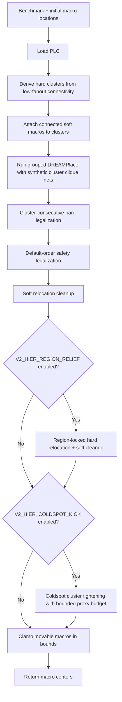

# v2 Design Flow

This document describes the current production flow implemented by
`src/placer/pipeline/macro_placer.py`.

## Current Mode

`MacroPlacer.place()` is hierarchy-only. It no longer branches between a
leaderboard/proxy path and a hierarchy path. If grouped DREAMPlace is unavailable,
the placer raises:

```text
hierarchy floorplan path unavailable; proxy fallback has been removed
```

The deleted proxy path included random candidate restarts, R2/2-opt/swap/cycle
search, generic LSMC exploration, generic cluster kicks, CUDA propose-all
integration in the main loop, and ML ranker defaults.

## Flow



## Cluster Derivation

Clusters are inferred from the flat ICCAD04-style netlist. The benchmarks do
not provide hierarchy directly, and direct hard-to-hard nets are sparse, so the
cluster builder uses low-fanout connectivity through soft macros.

Controls:

```text
V2_CLUSTER_MAX_FANOUT=8
V2_CLUSTER_MIN_EDGE=2
```

The result is a hard-macro label array plus a map of soft macros most strongly
associated with each hard cluster.

## Grouped DREAMPlace

The hierarchy path calls `run_dreamplace(..., cluster_groups=..., group_weight=...)`.
The bridge writes synthetic per-cluster clique nets into the Bookshelf design so
global placement pulls connected subsystems together.

Controls:

```text
V2_HIER_GROUP_WEIGHT=8
```

DREAMPlace is a required part of the current path. The old proxy fallback that
could run without it has been removed.

## Legalization

Hard macros are legalized with a cluster-consecutive order:

1. Larger clusters first.
2. Larger macros first within each cluster.
3. Unclustered macros last, also larger first.

A second default-order legalization pass is kept as a safety pass for validity.
Soft macros may overlap by challenge rules, so they are not hard-legalized.

## Region-Locked Relief

Region relief recovers some congestion while preserving the hierarchy. Each
cluster receives a soft region derived from its footprint and area. Hard
relocation then strongly prefers colder candidate cells inside the cluster's
own region, followed by soft relocation cleanup.

Controls:

```text
V2_HIER_REGION_RELIEF=1
V2_HIER_REGION_DENSITY=0.65
V2_REGION_BIAS=1.0
V2_HIER_REGION_ROUNDS=2
V2_HIER_REGION_BUDGET_S=40
V2_HIER_REGION_MARGIN=0
V2_HIER_REGION_SINGLETON=0.05
```

All committed relocation moves still pass the exact incremental proxy gate, but
candidate ranking is region-biased so the result stays clustered.

## Coldspot Tightening

The retained LSMC helper is `_coldspot_cluster_kick()`. It gathers one hot
cluster into a cold congestion window and legalizes the hard macros. In the
current production flow it is used only as a hierarchy-tightening pass after
region relief.

Controls:

```text
V2_HIER_COLDSPOT_KICK=1
V2_HIER_COLDSPOT_BUDGET=0.05
V2_HIER_COLDSPOT_TOTAL=0.15
V2_HIER_COLDSPOT_ROUNDS=8
V2_HIER_COLDSPOT_BUDGET_S=30
```

A kick is accepted only when intra-cluster spread decreases and the proxy rise
stays within the per-kick and total budgets.

## Entry Points

- Challenge path: `uv run evaluate src/main.py -b ibm10`
- eda_io path: `uv run python src/place_design.py ...`
- Coldspot verifier: `uv run python test/verification/_verify_coldspot_kick.py ibm10`

Every return path passes through the final in-bounds clamp for movable macros.
