# VivaPlace v2 — Design Flow

This document describes the current production flow implemented by
`src/placer/pipeline/macro_placer.py`.

## Current Mode

`MacroPlacer.place()` is hierarchy-only. It no longer branches between a
leaderboard/proxy path and a hierarchy path. If grouped DREAMPlace is unavailable,
the placer raises:

```text
hierarchy floorplan path unavailable; proxy fallback has been removed
```

The deleted proxy path included random candidate restarts, R2/2-opt/swap/cycle
search, generic LSMC exploration, generic cluster kicks, CUDA propose-all
integration in the main loop, and ML ranker defaults.

Current verification after adding exact-prescored seed portfolio selection,
hierarchy-aware congestion-weighted proposal ranking, plateau telemetry,
budget-aware pass scheduling, strong soft repair, swap-round micro-shift replay,
stronger opportunity gates, component-aware cleanup scheduling, component-aware
region expansion/decompression, small-design polish, no-release low-net soft/SS
breadth, medium/large soft-continuation scheduling, and strict final hierarchy
audit rollback with audit-aware local relief plus large-design graph-tension
opportunity ordering:

```text
uv run evaluate src/main.py --all
AVG 1.1666  17/17 VALID  0 overlaps  1216.10s
```

The same revision passes `uv run evaluate src/main.py --ng45` at `AVG 0.7252`,
4/4 VALID, zero overlaps, all hierarchy audits passed, in 232.41s.

The earlier `AVG 1.1627` hierarchy sweep remains an important proxy reference,
but its hierarchy audit was report-only. The current default enforces the audit
budget during local relief, rejects hard-moving swap candidates that exceed the
budget, and rolls back to the best saved audit-passing checkpoint when a later
proxy-improving state drifts too far from the selected hierarchy seed. The
strict final-rollback-only sweep was `AVG 1.1999`; earlier enforcement recovers
most of that proxy loss while preserving the hierarchy invariant.

The required DREAMPlace runtime is reproducible from a clean checkout through
`scripts/dreamplace/bootstrap.sh all`. Production probes representative native
extensions in the build Python before placement; use
`scripts/dreamplace/bootstrap.sh preflight` for the same standalone check.

Large designs additionally compute a hierarchy graph-tension signal from
stretched inter-cluster edges and congestion along those edge corridors. The
signal only orders decompression and coldspot opportunities by default. Optional
swap-stage graph guidance uses:

```text
HIER_GRAPH_TENSION_SWAP_WEIGHT   (default 0.0)
HIER_SWAP_GRAPH_MASK_AWARE       (default True)
HIER_SWAP_GRAPH_MASK_MAX_EDGES   (default 0)
HIER_SWAP_GRAPH_MASK_PAD_CELLS   (default 1)
HIER_SWAP_GRAPH_MASK_PENALTY_WEIGHT (default 0.30)
HIER_SWAP_GRAPH_DELTA_WEIGHT     (default 0.0)
HIER_SWAP_GRAPH_DELTA_SAMPLES    (default 9)
HIER_SWAP_GRAPH_FALLBACK         (default True)
HIER_SWAP_GRAPH_FALLBACK_BUDGET_S (default 2.5)
```

Graph swap guidance is off in score terms unless you set
`HIER_GRAPH_TENSION_SWAP_WEIGHT > 0` and/or `HIER_SWAP_GRAPH_DELTA_WEIGHT >
0.0`, so current runs remain equivalent when those are unset.
`scripts/gnn/analyze_graph_tension.py` summarizes trace rows for this signal.
Candidate traces now include graph-edge deltas for coldspot and decompression:
edge stretch, corridor congestion, weighted edge length, and combined graph
delta. These are used for analysis only, not commit gates.
The default-off `HIER_COLDSPOT_GRAPH_DELTA_RANK` hook can add a
proxy-equivalent penalty for graph-worsening coldspot candidates before the
normal exact-proxy rank. It remains opt-in because focused `ibm10`/`ibm12`
tests were valid but did not improve proxy.
The default-off `HIER_REGION_GRAPH_COMPONENT_WEIGHT` hook uses graph edge
corridors to choose among nearby contiguous cold components during early region
expansion; it remains opt-in after focused `ibm10` regression.
The default-off `HIER_COLDSPOT_GRAPH_ANCHOR_WEIGHT` hook lets graph context
rank coldspot anchors toward a selected cluster's weighted graph-neighbor
centroid while keeping exact proxy and hierarchy gates unchanged.
The default-on `HIER_DECOMPRESS_FEASIBILITY_FILTER` screens decompression
candidates by estimated free area and neighbor blockage before legalization and
exact scoring.
The default-off `HIER_DECOMPRESS_GRAPH_RESCUE` hook can retry graph-favorable
decompression candidates that fail feasibility or hard overlap using smaller
and cold-component-shifted variants. The rescued candidate still needs normal
hard legality, hierarchy quality, exact proxy gain, and audit pass. It remains
opt-in because the first full-suite run was legal but slightly regressive.
The default-on `HIER_DECOMPRESS_GRAPH_SURVIVOR` hook handles a narrower case:
legal graph-favorable decompression candidates that just miss exact proxy. It
spends a small capped exact-scored hard/soft local-polish pool and accepts only
if the polished candidate clears the normal proxy and audit gates.
The default-off `HIER_GRAPH_PREFILTER` hook can skip low-tension candidates
whose cheap local congestion estimate fails to improve before exact scoring or
coldspot refinement; it remains diagnostic because the focused `ibm10` control
was better with the filter disabled.
The default-off `HIER_COLDSPOT_EGONET` scaffold can add temporary coldspot
candidate groups made from a selected cluster plus small graph neighbors. Trace
mining showed large soft-carrying ego-net moves were too disruptive, so the
current opt-in default is hard-only, low-displacement, and requires an extra
exact-gain floor before commit. The original hierarchy graph, exact proxy gates,
and audit gates remain unchanged.

Passes are now adaptive by gain. A stage exits and advances when the most recent
full exact proxy gain is `<= HIER_PLATEAU_PROXY_GAIN` (`0.00005`), instead of
running a fixed number of low-yield rounds.

For per-stage technical detail (what each box below does, which file
implements it, and the constants that control it), see
[ARCHITECTURE.md](ARCHITECTURE.md). This document is the flow diagram only.

## Flow

```mermaid
flowchart TD
    A[Benchmark + initial macro locations] --> B[Load PLC]
    B --> C[Build HierarchyModel from inferred connectivity]
    C --> D[Classify soft macros as owned or bridge]
    D --> E[Run grouped DREAMPlace with synthetic cluster clique nets]
    E --> F[Cluster-consecutive hard legalization]
    F --> E1[Exact-prescore seed portfolio + hierarchy vector]
    E1 --> G[Default-order safety legalization]
    G --> H[Soft relocation cleanup]
    H --> R[Congestion-expanded hard/soft regions]
    R --> J[Region-locked hard relocation + soft cleanup]
    J --> A1[In-region micro-shift polish]
    A1 --> V[Exact-gated cluster decompression + graph-tension ordering]
    V --> T[Region-bounded hard-hard / hard-soft / soft-soft swaps]
    T --> T1[Per-round micro-shift replay + audit checkpoint]
    T1 --> Y[Post-swap micro-shift replay]
    Y --> P{HIER_POST_RELOC_PROPOSE_ALL enabled?}
    P -->|Yes| Q[Post-swap hard propose-all polish]
    P -->|No| W
    Q --> X[Post-swap soft relocation polish]
    W --> X
    X --> X1{Strong soft repair scheduled?}
    X1 -->|Yes| X2[Plateau/component-aware strong soft repair]
    X1 -->|No| L
    X2 --> L[Coldspot cluster tightening with optional ego-net candidates]
    L --> Z[Post-coldspot micro-shift replay]
    Z --> Z2{Small-design polish gated?}
    Z2 -->|Yes| Z3[Low-confidence hierarchy release + exact polish]
    Z2 -->|No| M
    Z3 --> M[Final hierarchy audit + rollback checkpoint]
    M --> N[Return macro centers]
```



Every return path passes through a final in-bounds clamp for movable macros.
`PlacementState` carries hard/soft coordinates and exact proxy through the
pipeline; each pass returns a `PassResult` summary, optionally written to the
GNN trace logger (`HIER_GNN_TRACE=1`, default off).

The seed portfolio records a complete hierarchy vector for every candidate:
hard-cluster compactness and worst spread, nearest-neighbor cluster impurity,
weighted hierarchy-edge stretch, owned-soft distance, and bridge-soft corridor
distance. Production still advances the lowest exact-proxy seed. The
`HIER_SEED_HIERARCHY_SELECT=1` experiment instead uses proxy only within the
best hierarchy-quality band; it is default-off after the ibm10 hierarchy win
caused a large proxy regression.

After post-coldspot cleanup, small designs can run one extra exact-gated polish pass.
This pass targets a feature-defined shape: small hard-macro population,
moderate total macro count, and no fixed hard macros. It is feature-gated rather
than benchmark-name gated. The release candidate pool
starts with the weakest-k inferred hierarchy clusters by confidence, filters
that set by the confidence threshold, and releases the hottest remaining weak
clusters. The release count is capped by
`min(max_clusters, clusters_below_threshold, weakest_k)`. Released clusters
expand their hard and soft region boxes to full canvas-feasible bounds.
The pass then tries bounded hard propose-all relocation, soft relocation, an
explicit released-region hard-hard swap pass, released-region hard-soft/soft-soft
swaps, and micro-shift polish. The hard-hard swap pass is itself gated: it only
runs when at least one weak cluster was released and the preceding hard
relocation subpass cleared the small-design gain threshold. It runs up to two
adaptive rounds and stops when the latest round does not clear the small-design
gain threshold. The pass snapshots its entry state and restores the best
audit-passing exact score seen across its adaptive rounds before handing control
back to the main hierarchy flow. Every committed move must improve exact proxy,
preserve hard legality, and keep the returned small-design state inside the
final hierarchy-audit budget.

Hard and soft relocation inside this pass use cold connected-component target
pools. The current weighted congestion field is thresholded into cold cells,
4-neighbor connected components are extracted, and targets from larger/colder
components receive a lower component penalty. That penalty is used only in
candidate ordering and target truncation; exact proxy remains the commit gate.

Constants in `src/utils/constants.py`:

```text
HIER_SMALL_DESIGN_POLISH=True
HIER_SMALL_DESIGN_HARD_MIN=240
HIER_SMALL_DESIGN_HARD_MAX=420
HIER_SMALL_DESIGN_MACRO_MAX=1600
HIER_SMALL_DESIGN_BUDGET_S=14
HIER_SMALL_DESIGN_ROUNDS=2
HIER_SMALL_DESIGN_RELEASE_CONFIDENCE_MAX=0.92
HIER_SMALL_DESIGN_RELEASE_WEAKEST_K=4
HIER_SMALL_DESIGN_RELEASE_MAX_CLUSTERS=8
HIER_SMALL_DESIGN_HIGH_NETS_PER_MACRO=24
HIER_SMALL_DESIGN_NO_RELEASE_LOW_NET_HARD_TOP_K=64
HIER_SMALL_DESIGN_NO_RELEASE_LOW_NET_HARD_TARGETS=12
HIER_SMALL_DESIGN_NO_RELEASE_LOW_NET_SOFT_TOP_K=384
HIER_SMALL_DESIGN_NO_RELEASE_LOW_NET_SOFT_TARGETS=12
HIER_SMALL_DESIGN_NO_RELEASE_LOW_NET_SWAP_SOFT_K=24
HIER_SMALL_DESIGN_HARD_SWAP_K=8
HIER_SMALL_DESIGN_SWAP_HARD_K=8
HIER_SMALL_DESIGN_SWAP_SOFT_K=16
HIER_COLD_COMPONENT_TARGETS=True
HIER_COLD_COMPONENT_PCT=45
HIER_COLD_COMPONENT_MAX_COMPONENTS=8
HIER_COLD_COMPONENT_MIN_CELLS=4
HIER_COLD_COMPONENT_SIZE_WEIGHT=0.35
HIER_COLD_COMPONENT_RANK_WEIGHT=0.04
```

The no-release low-net constants apply only when the small-design gate passes,
the high-net lane is inactive, and no weak hierarchy cluster is released. They
reduce hard-relocation breadth and increase soft relocation / soft-involving
swap breadth; exact proxy and hard legality remain the only acceptance gates.

Medium/large soft-continuation constants:

```text
HIER_MEDIUM_SOFT_CONTINUATION=True
HIER_MEDIUM_SOFT_HARD_MIN=520
HIER_MEDIUM_SOFT_HARD_MAX=760
HIER_MEDIUM_SOFT_MACRO_MIN=2200
HIER_MEDIUM_SOFT_MACRO_MAX=3200
HIER_MEDIUM_SOFT_NETS_PER_MACRO_MIN=12
HIER_MEDIUM_SOFT_NETS_PER_MACRO_MAX=24
HIER_MEDIUM_SOFT_TRIGGER_GAIN=0.004
HIER_MEDIUM_SOFT_BUDGET_S=6
HIER_MEDIUM_SOFT_ROUNDS=2
HIER_MEDIUM_SOFT_TOP_K=768
HIER_MEDIUM_SOFT_TARGETS=14
```

A default-off coldspot GNN selector can be enabled with runtime environment
variables, not constants:

```text
HIER_GNN_COLDSPOT_SELECT=1
HIER_GNN_COLDSPOT_MODEL=path/to/model.pt
HIER_GNN_COLDSPOT_POLICY=0
HIER_GNN_COLDSPOT_POLICY_MODEL=path/to/model.pt
HIER_GNN_CLUSTER_MODE=0
HIER_GNN_COLDSPOT_KICKS=8
HIER_GNN_COLDSPOT_TOP_K=1
HIER_GNN_COLDSPOT_CLUSTER_TOP_K=1
HIER_GNN_COLDSPOT_POLICY_TOP_K=1
HIER_GNN_COLDSPOT_SKIP_MICRO=1
HIER_GNN_COLDSPOT_ORACLE=0
HIER_COLDSPOT_GNN_MAX_CLUSTERS=1
```

When enabled, the same heuristic coldspot round still selects the hot cluster
and cold window. The placer then generates a no-op candidate plus several kicked
outcomes for that selected cluster/window and asks a ranker to reorder them.

`HIER_GNN_CLUSTER_MODE=1` shifts GNN usage from macro-level ranking to
cluster-level coldspot ranking. In this mode, `HIER_GNN_RANK=1` is interpreted
through `coldspot_cluster` policy only; relocation and swap re-ordering remain off.
`HIER_GNN_COLDSPOT_CLUSTER_TOP_K` (default `1`) controls how many re-ordered coldspot
cluster candidates are promoted into the top selector slice before exact scoring.

With `HIER_GNN_COLDSPOT_SELECT=1`, exact scoring stays on the refined candidates,
while `HIER_GNN_COLDSPOT_POLICY=1` can rank raw proposals first and send only
the top policy proposals into the expensive local-refine path. The normal hard
legality, hierarchy-quality, total-budget, and exact-proxy gates remain
mandatory. With `HIER_GNN_COLDSPOT_SKIP_MICRO=1`, post-coldspot micro-shift
replay is skipped so the selector replaces that local refinement step during
diagnostics. Move
`HIER_COLDSPOT_GNN_MAX_CLUSTERS` above `1` to allow multi-source
candidate expansion.
`HIER_GNN_COLDSPOT_ORACLE=1` is for trace collection: it exact-scores all
generated candidates in the pool, but with selector disabled it still commits
only the legacy first generated kick, preserving default placement behavior.

## BeyondPPA And GNN Hooks

The current BeyondPPA integration is hierarchy-integrated: a local structural
term can reorder existing relocation candidates, and production keeps that
ranking disabled by default. It does not create a separate placement path.

The current production GNN behavior is still non-mutating. Trace logging is
controlled by runtime environment variables, not `src/utils/constants.py`.
Enable it with:

```bash
uv run evaluate src/main.py -b ibm10                          # single benchmark
uv run evaluate src/main.py --all                              # full IBM suite
uv run python src/place_design.py ...                           # eda_io path
uv run python test/verification/_verify_coldspot_kick.py ibm10  # coldspot verifier
```

## GPU Status

The hierarchy path uses CUDA through DREAMPlace when PyTorch can see a GPU.
The `cuda_delta` scorer is verified for hard/soft relocation proposal batches
and is used by post-swap propose-all hard relocation; bounded relocation and
micro-shift can reuse it for large local target batches, but small cleanup
batches stay on the faster incremental CPU path by default. Region swaps and
cluster decompression remain sequential exact-gated CPU/NumPy passes — region
swap candidate ranking can use CUDA sorting for large rank arrays, but there
is no batched GPU exact-scoring kernel.

See [OBJECTIVES.md](OBJECTIVES.md) for the structural objectives behind these
passes, and [`../ml_nn/beyondppa_results/`](../ml_nn/beyondppa_results/) for
the active GNN trace and dataset schemas.
