# v2 Design Flow

This document describes the current production flow implemented by
`src/placer/pipeline/macro_placer.py`.

## Current Mode

`MacroPlacer.place()` is hierarchy-only. It no longer branches between a
leaderboard/proxy path and a hierarchy path. If grouped DREAMPlace is unavailable,
the placer raises:

```text
hierarchy floorplan path unavailable; proxy fallback has been removed
```

The deleted proxy path included random candidate restarts, R2/2-opt/swap/cycle
search, generic LSMC exploration, generic cluster kicks, CUDA propose-all
integration in the main loop, and ML ranker defaults.

Current verification after adding exact-prescored seed portfolio selection,
hierarchy-aware congestion-weighted proposal ranking, plateau telemetry,
budget-aware pass scheduling, and strong soft repair:

```text
uv run evaluate src/main.py --all
AVG 1.1827  17/17 VALID  0 overlaps  1328.33s
```

## Flow

```mermaid
flowchart TD
    A[Benchmark + initial macro locations] --> B[Load PLC]
    B --> C[Build HierarchyModel from inferred connectivity]
    C --> D[Classify soft macros as owned or bridge]
    D --> E[Run grouped DREAMPlace with synthetic cluster clique nets]
    E --> F[Cluster-consecutive hard legalization]
    F --> E1[Exact-prescore seed portfolio]
    E1 --> G[Default-order safety legalization]
    G --> H[Soft relocation cleanup]
    H --> I{HIER_REGION_RELIEF enabled?}
    I -->|Yes| R[Congestion-expanded hard/soft regions]
    R --> J[Region-locked hard relocation + soft cleanup]
    I -->|No| K
    J --> A1[In-region micro-shift polish]
    A1 --> U{HIER_DECOMPRESS enabled?}
    U -->|Yes| V[Exact-gated cluster decompression]
    U -->|No| S
    V --> S{HIER_REGION_SWAPS enabled?}
    S -->|Yes| T[Region-bounded hard-hard / hard-soft / soft-soft swaps]
    S -->|No| P
    T --> Y[Post-swap micro-shift replay]
    Y --> P{HIER_POST_RELOC_PROPOSE_ALL enabled?}
    P -->|Yes| Q[Post-swap hard propose-all polish]
    P -->|No| W
    Q --> W{HIER_POST_SOFT_RELOC enabled?}
    W -->|Yes| X[Post-swap soft relocation polish]
    W -->|No| X1
    X --> X1{Strong soft repair scheduled?}
    X1 -->|Yes| X2[Budget-aware strong soft repair]
    X1 -->|No| K
    X2 --> K{HIER_COLDSPOT_KICK enabled?}
    K -->|Yes| L[Coldspot cluster tightening with bounded proxy budget]
    K -->|No| M[Clamp movable macros in bounds]
    L --> Z[Post-coldspot micro-shift replay]
    Z --> M
    M --> N[Return macro centers]
```



## Cluster Derivation

`HierarchyModel.build()` owns cluster construction for the production flow. On
benchmarks whose macro names carry slash-separated RTL instance paths, such as
NG45, hard clusters are derived from useful path prefixes first. Flat ICCAD04
benchmarks do not provide hierarchy directly, so they still fall back to
low-fanout connectivity through soft macros. The model also records
inter-cluster edge weights and confidence diagnostics. Full recursive weighted
splitting was tested and removed from production code because it regressed
full-suite proxy. The active production compromise for flat inferred clusters
is gated oversized splitting: only bridge-connected flat clusters above 40% of
the hard macros are eligible, and a split is kept only when the resulting
leaves get near the 15% target.

Constants in `src/utils/constants.py`:

```text
CLUSTER_MAX_FANOUT=8
CLUSTER_MIN_EDGE=2
HIER_OVERSIZE_CLUSTER_SPLIT=1
HIER_TAG_PREFIX_CLUSTERING=1
HIER_TAG_PREFIX_MAX_DEPTH=5
HIER_TAG_PREFIX_MIN_GROUP=2
HIER_TAG_PREFIX_MIN_COVERAGE=0.25
HIER_OVERSIZE_CLUSTER_START_FRAC=0.40
HIER_OVERSIZE_CLUSTER_TARGET_FRAC=0.15
HIER_OVERSIZE_CLUSTER_TARGET_TOL=1.10
HIER_OVERSIZE_CLUSTER_MIN_BRIDGE_SOFTS=5
HIER_OVERSIZE_CLUSTER_MIN_SIZE=6
HIER_OVERSIZE_CLUSTER_MAX_CUT_RATIO=0.45
```

The result is a hard-macro label array plus soft roles:

- owned softs have one dominant cluster affinity and may be grouped/moved with
  that cluster;
- bridge softs connect multiple clusters with comparable strength and receive a
  soft region spanning those clusters.

Cluster-room and bridge-corridor modeling was also tested and removed from
production code because the corridor boxes were too restrictive on packed
benchmarks.

## Grouped DREAMPlace

The hierarchy path calls `run_dreamplace(..., cluster_groups=..., group_weight=...)`.
The bridge writes synthetic per-cluster clique nets into the Bookshelf design so
global placement pulls connected subsystems together.

Constants in `src/utils/constants.py`:

```text
HIER_GROUP_WEIGHT=8
```

DREAMPlace is a required part of the current path. The old proxy fallback that
could run without it has been removed.

## Seed Portfolio Prescoring

The grouped DREAMPlace result is no longer the only possible starting basin.
Before region relief, the placer exact-prescores a small legalized seed
portfolio:

- grouped DREAMPlace;
- legalized `initial.plc`;
- two DREAMPlace/initial blends;
- a radial expansion seed;
- a synthetic-clearance seed.

The lowest exact-proxy seed enters the rest of the hierarchy pipeline. This
implements the first-place competition lesson that seed basin choice can
dominate late local search. It is still constrained by fixed-macro immobility,
hard legality, bounds, hierarchy regions, hierarchy-quality checks, and exact
accept gates.

Constants in `src/utils/constants.py`:

```text
HIER_SEED_PORTFOLIO=1
HIER_SEED_BLEND_ALPHAS=0.35,0.65
HIER_SEED_EXPANSION_FRAC=0.06
HIER_SEED_SYNTHETIC_CLEARANCE=1
HIER_SEED_CLEARANCE_FRAC=0.08
HIER_SEED_CLEARANCE_ITERS=3
HIER_SEED_CLEARANCE_AREA_PCT=97
```

## Legalization

Hard macros are legalized with a cluster-consecutive order:

1. Larger clusters first.
2. Connectivity-pressure x area first within each cluster by default; set
   `HIER_LEGALIZE_CONNECTIVITY_ORDER=False` restores larger-macro-first order.
3. Unclustered macros last, with the same member ordering.

A second default-order legalization pass is kept as a safety pass for validity.
Soft macros may overlap by challenge rules, so they are not hard-legalized.

## Region-Locked Relief

Region relief recovers some congestion while preserving the hierarchy. Each
cluster receives a soft region derived from its footprint and area. Hard
relocation then strongly prefers lower values in a congestion-heavy blended
proposal field inside the cluster's own region, followed by soft relocation
cleanup. Soft macros receive analogous region boxes from their assigned hard
cluster or bridge affinities. A move may leave its region only when the exact
proxy improvement exceeds the configured escape threshold.
Before relief runs, hot cluster regions expand toward colder neighboring grid
bands so packed hierarchy blobs get room to create routing channels.

Constants in `src/utils/constants.py`:

```text
HIER_REGION_RELIEF=1
HIER_REGION_DENSITY=0.65
REGION_BIAS=1.0
HIER_REGION_ROUNDS=2
HIER_REGION_BUDGET_S=40
HIER_REGION_MARGIN=0
HIER_REGION_SINGLETON=0.05
HIER_REGION_ESCAPE_MIN=0.002
HIER_BRIDGE_SOFTS=1
HIER_BRIDGE_SOFT_RATIO=0.6
HIER_CONG_EXPAND_REGIONS=1
HIER_REGION_EXPAND_HOT_PCT=60
HIER_REGION_EXPAND_FRAC=0.08
HIER_REGION_EXPAND_BAND=3
HIER_CONGESTION_WEIGHTED_PROPOSALS=1
HIER_PROPOSAL_CONGESTION_WEIGHT=2.5
HIER_PROPOSAL_DENSITY_WEIGHT=1.0
HIER_PROPOSAL_HIERARCHY_AWARE=1
HIER_PROPOSAL_OUTSIDE_RELIEF_MARGIN=0.08
```

All committed relocation moves still pass the exact incremental proxy gate, but
candidate ranking is congestion-weighted and region-biased so the result does
not rely on the weighted proposal field as an accept rule.
When weighted ranking is active, out-of-region candidates are also prefiltered:
if an in-region target exists, an outside target must beat the best in-region
field relief by `HIER_PROPOSAL_OUTSIDE_RELIEF_MARGIN` times the proposal-field
span before it can enter the truncated ranked set.

The same relocation operators include deterministic BeyondPPA-style structural
candidate ordering, currently disabled by its zero weight:

```text
HIER_OBJECTIVE_STRUCTURAL_WEIGHT=0.0
HIER_KEEP_OUT_WEIGHT=0.2
HIER_GRID_ALIGN_WEIGHT=0.2
HIER_NOTCH_WEIGHT=0.6
```

The structural term scores local edge keepout, grid alignment, and notch
avoidance. It only reorders candidates inside the hierarchy flow. All committed
moves still require legality, fixed-macro immobility, bounds, hierarchy-region
constraints, and the existing exact-proxy or hierarchy-quality gates. The
default weight is `0.0`.

After each region-relief round, `_micro_shift_polish()` runs tiny exact-gated
one/two-grid-cell moves inside the same hierarchy-region constraints:

```text
HIER_MICRO_SHIFT=1
HIER_MICRO_SHIFT_RADIUS=2
HIER_MICRO_SHIFT_TOP=96
HIER_MICRO_SHIFT_MIN_GAIN=0.00001
```

## Cluster Decompression

Cluster decompression creates routing channels inside hot hierarchy blobs. It
builds full-placement candidates by expanding a hot cluster away from its
centroid inside the expanded region, legalizes hard macros, moves owned softs
with the cluster, and nudges bridge softs toward the corridor centroid. The
candidate is accepted only when full exact proxy improves and the composite
hierarchy-quality metric stays within budget. That metric combines mean
cluster radius, bounding-box spread, and a small nearest-cluster crowding
penalty.

Constants in `src/utils/constants.py`:

```text
HIER_DECOMPRESS=1
HIER_DECOMPRESS_BUDGET_S=18
HIER_DECOMPRESS_ROUNDS=2
HIER_DECOMPRESS_HOT_PCT=65
HIER_DECOMPRESS_FACTORS=1.08,1.16,1.25
HIER_DECOMPRESS_MIN_GAIN=0.0001
HIER_QUALITY_BUDGET=0.03
HIER_QUALITY_RADIUS_WEIGHT=0.75
HIER_QUALITY_BBOX_WEIGHT=0.20
HIER_QUALITY_CROWD_WEIGHT=0.05
HIER_DECOMPRESS_ANISO=1
HIER_DECOMPRESS_ANISO_BAND=3
HIER_DECOMPRESS_ANISO_SECONDARY=0.25
```

## Region-Bounded Swaps

After region relocation, the hierarchy path can run a small swap-relief pass.
It tries hard-hard 2-opt, hard-soft cross swaps, and soft-soft swaps against the
live congestion and density fields. In-region swaps use the normal exact-proxy
accept gate; swaps that move either participant outside its region must improve
proxy by at least `HIER_REGION_ESCAPE_MIN`.

Constants in `src/utils/constants.py`:

```text
HIER_REGION_SWAPS=1
HIER_REGION_SWAP_ROUNDS=2
HIER_REGION_SWAP_BUDGET_S=20
HIER_HARD_SWAP_K=16
HIER_SOFT_SWAP_K=48
HIER_SWAP_MIN_GAIN=0.00001
HIER_SWAP_MIN_FIELD_RELIEF=0.0
HIER_SWAP_HH=1
HIER_SWAP_HS=1
HIER_SWAP_SS=1
HIER_SWAP_DENSITY_FIELD=1
```

The pass logs per-operator score/accept counts.

The accepted Stage-3 flow replays `_micro_shift_polish()` immediately after
region swaps. This exact-gated one/two-grid-cell pass is enabled by default
with `HIER_POST_SWAP_MICRO_SHIFT=1` and recovers small hard and soft
congestion improvements left behind by swaps.

When local pass budget has at least `HIER_ADDITIVE_MIN_SPARE_S` seconds
remaining, the swap and hard propose-all passes exact-check a small additive
tail after the deterministic candidate prefix. This keeps deterministic order
authoritative while spending spare budget on candidates that were previously
truncated.

Stage 3 adds a small interleaved soft-only repair immediately after cluster
decompression and before region swaps. It uses the same soft hierarchy regions
and exact-proxy accept gate as late soft repair, but is capped to a short budget
so it can seed swaps without replacing them.

The late strong soft repair is a soft-only pass with larger target pools and
the same exact-proxy gate. Budget-aware scheduling uses pass plateau telemetry:
the pass starts only if at least `HIER_STRONG_SOFT_REPAIR_MIN_SPARE_S` seconds
remain and recent swap/post-swap cleanup telemetry shows a plateau or useful
soft-move signal. Stage 4 adds a plateau-driven operator switch: when the hard
and swap cleanup stack is plateaued and enough time remains, the scheduler gives
strong soft repair one extra round and a small budget bonus. This improves soft
congestion cleanup without reopening hard macro legality.

Stage 5 implements GPU-ranked additive hard-relocation tails, but leaves them
default-off (`HIER_GPU_RANK_ADDITIVE_TAILS=0`) after the IBM sweep showed no
hard propose-all accepts and a small regression. The code remains available for
opt-in experiments where additive hard tails are active.

Stage 6 adds a final audit-only hard legality margin report using the same
`0.05` separation tolerance as local legality tests. The evaluator can still
report 0 overlaps when this strict margin is slightly negative; the audit makes
that near-contact visible in trace and summary logs.

```text
HIER_ADDITIVE_CANDIDATE_POOLS=1
HIER_GPU_RANK_ADDITIVE_TAILS=0
HIER_ADDITIVE_RELOC_EXTRA_TOP_K=8
HIER_ADDITIVE_SWAP_EXTRA_K=4
HIER_ADDITIVE_MIN_SPARE_S=2.0
HIER_INTERLEAVED_SOFT_REPAIR=1
HIER_INTERLEAVED_SOFT_REPAIR_BUDGET_S=3
HIER_INTERLEAVED_SOFT_REPAIR_MIN_SPARE_S=12
HIER_STRONG_SOFT_REPAIR=1
HIER_STRONG_SOFT_REPAIR_BUDGET_S=12
HIER_STRONG_SOFT_REPAIR_MIN_SPARE_S=2
HIER_STRONG_SOFT_REPAIR_TOP_K=512
HIER_STRONG_SOFT_REPAIR_TARGETS=12
HIER_PLATEAU_TELEMETRY=1
HIER_BUDGET_AWARE_SCHEDULING=1
HIER_PLATEAU_SOFT_REPAIR_BONUS=1
HIER_PLATEAU_SOFT_REPAIR_BONUS_BUDGET_S=4
HIER_PLATEAU_SOFT_REPAIR_BONUS_ROUNDS=1
HIER_LEGALITY_MARGIN_AUDIT=1
HIER_LEGALITY_MARGIN_EPS=0.05
```

## Coldspot Tightening

The retained LSMC helper is `_coldspot_cluster_kick()`. It gathers one hot
cluster into a cold congestion window, co-moves its owned soft macros, and
legalizes the hard macros. Each kicked candidate is then locally refined inside
a slightly expanded cluster box before the normal exact-proxy and
hierarchy-quality gates run.

Constants in `src/utils/constants.py`:

```text
HIER_COLDSPOT_KICK=1
HIER_COLDSPOT_BUDGET=0.0
HIER_COLDSPOT_TOTAL=0.0
HIER_COLDSPOT_MIN_GAIN=0.0001
HIER_COLDSPOT_QUALITY_BUDGET=0.01
HIER_COLDSPOT_MIN_FIELD_GAP=0.02
HIER_COLDSPOT_ROUNDS=8
HIER_COLDSPOT_BUDGET_S=30
HIER_COLDSPOT_LOCAL_REFINE=1
HIER_COLDSPOT_LOCAL_HARD_PAD_FRAC=0.50
HIER_COLDSPOT_LOCAL_MIN_PAD_CELLS=1
HIER_COLDSPOT_LOCAL_MAX_PAD_FRAC=0.12
HIER_COLDSPOT_LOCAL_SOFT_ESCAPE_MIN=0.0025
HIER_COLDSPOT_GRAPH_SELECT=1
HIER_COLDSPOT_GRAPH_SELECT_CANDIDATES=4
HIER_COLDSPOT_GRAPH_SELECT_TOP_K=2
HIER_COLDSPOT_GRAPH_TARGET_POOL=1
HIER_COLDSPOT_GRAPH_MASK_GATING=1
HIER_COLDSPOT_GRAPH_FALLBACK=1
HIER_COLDSPOT_GRAPH_FALLBACK_TOP_K=3
HIER_COLDSPOT_ADAPTIVE_REGIONS=1
HIER_COLDSPOT_MEMORY_COLD_PCT=35
HIER_COLDSPOT_ADAPTIVE_MAX_CELLS=5
```

A round first requires a cheap congestion-field opportunity: an eligible cluster
must be at least `HIER_COLDSPOT_MIN_FIELD_GAP` hotter than its best matching
cold window. The local refinement pass runs hard-hard and hard-soft swaps with
the kicked hard cluster locked inside the local box, then soft-soft swaps and
soft relocation with a soft escape gate of
`HIER_COLDSPOT_LOCAL_SOFT_ESCAPE_MIN`. The local box includes owned/bridge soft
macros, but its base pad is derived from the kicked hard-core max dimension, not
from the soft-inclusive bbox. The pad is clamped by
`HIER_COLDSPOT_LOCAL_MIN_PAD_CELLS` and `HIER_COLDSPOT_LOCAL_MAX_PAD_FRAC`.
Hard relocation is also bounded by the local box. The coldspot phase tracks the
current low-congestion grid cells and masks out cells occupied by each refined
candidate. This cold-cell map is refreshed from the current scorer field after
every finalized coldspot kick, so adaptive bounds do not use stale coldspots.
Before padding is applied, the local seed border is expanded through open cold
cells up to `HIER_COLDSPOT_ADAPTIVE_MAX_CELLS` grid nodes away from the
cluster-defined seed. The hard-core pad is applied after that graph expansion,
giving swaps and soft-locked relocations room around the usable coldspot area. A
graph-derived target pool and graph-expanded target mask are passed to
coldspot-local hard and soft relocation. Generated outcomes are graph-ranked
before exact gating when the GNN selector is disabled. If no kick commits, the
graph-local fallback selects the hottest eligible clusters in the current
placement and runs the same graph-bordered swaps and relocations without a
cluster kick first. A refined kick or fallback move is accepted only when exact
proxy improves and the hierarchy-quality metric stays within budget. This keeps
the pass from undoing congestion relief for compactness alone.

Production then replays `_micro_shift_polish()` once more with
`HIER_POST_COLDSPOT_MICRO_SHIFT=1`. The paired post-swap and post-coldspot
replays are the current accepted stack. Deterministic hot-cluster coldspot
selection was tested separately and removed after regressing the full sweep.

A default-off coldspot GNN selector can be enabled with runtime environment
variables, not constants:

```text
HIER_GNN_COLDSPOT_SELECT=1
HIER_GNN_COLDSPOT_MODEL=path/to/model.pt
HIER_GNN_COLDSPOT_KICKS=8
HIER_GNN_COLDSPOT_TOP_K=1
HIER_GNN_COLDSPOT_SKIP_MICRO=1
HIER_GNN_COLDSPOT_ORACLE=0
```

When enabled, the same heuristic coldspot round still selects the hot cluster
and cold window. The placer then generates a no-op candidate plus several kicked
outcomes for that selected cluster/window, asks the model to rank them, and
exact-scores only the selected top slice. The normal hard legality,
hierarchy-quality, total-budget, and exact-proxy gates remain mandatory. With
`HIER_GNN_COLDSPOT_SKIP_MICRO=1`, post-coldspot micro-shift replay is skipped so
the selector replaces that local refinement step during diagnostics.
`HIER_GNN_COLDSPOT_ORACLE=1` is for trace collection: it exact-scores all
generated candidates in the pool, but with selector disabled it still commits
only the legacy first generated kick, preserving default placement behavior.

## BeyondPPA And GNN Hooks

The current BeyondPPA integration is deterministic and hierarchy-integrated:

- structural metrics live in `src/placer/local_search/structural_fields.py`;
- structural candidate ordering lives inside existing relocation ranking;
- production defaults keep structural ranking disabled.

The current production GNN behavior is still non-mutating. Trace logging is
controlled by runtime environment variables, not `src/utils/constants.py`.
Enable it with:

```bash
HIER_GNN_TRACE=1 HIER_GNN_TRACE_RUN=ibm10_trace uv run evaluate src/main.py -b ibm10
```

Trace JSONL files are written under `ml_data/beyondppa_gnn/` unless
`HIER_GNN_TRACE_PATH` is supplied. Logging does not change placement output.
Schema-v1 traces can be converted into graph datasets with
`scripts/gnn/build_gnn_dataset.py`. Stage-G3 offline baseline rankers can be trained
and evaluated with `scripts/gnn/train_gnn_baseline.py`; this remains offline only
and does not affect placement.

Plateau telemetry is separate from candidate GNN traces and is default-on for
future ML/DL scheduling work. Rows are written to
`ml_data/beyondppa_gnn/plateau/plateau_telemetry.jsonl` by default and include
pass runtime, candidate/legal/scored counts, accepts, proxy gain, plateau flag,
and budget scheduler decisions. Set `HIER_PLATEAU_TRACE=0` to disable it or
`HIER_PLATEAU_TRACE_PATH` to redirect it.

Stage G3 has an accepted default-off offline baseline artifact, Stage G4 has an
accepted default-off offline macro-net ranker artifact, and Stage G5 has a
smoke-accepted default-off relocation-only candidate-reordering hook. The
Stage G6 full-suite run was valid but not promoted because average proxy and
runtime regressed. A default-off coldspot selector now ranks generated coldspot
kick outcomes, but it is diagnostic-only and not promoted. The primary learned
target is regional relief: hard relocation plus region-bounded hard-hard,
hard-soft, and soft-soft swaps. `HIER_GNN_OPERATORS=region_swaps` enables the
default-off swap ranker hook, and `HIER_SOFT_BARRIER_GAIN=0.01` can be used in
diagnostics to require stronger exact-proxy improvement before soft relocation
or soft-involving swaps commit. Production keeps this barrier at `0.0`. The
long-term target is a default-off hierarchy-flow assistant that may rank,
propose, select, budget, and diagnose work inside existing hierarchy operators
while leaving legality, fixed-macro, bounds, hierarchy-region,
hierarchy-quality, and exact-proxy gates authoritative. The dedicated GNN
project plan is in
[../ml_nn/gnn/README.md](../ml_nn/gnn/README.md), and the implementation record
is in
[../ml_nn/beyondppa_results/gnn_full_implementation_next_steps.md](../ml_nn/beyondppa_results/gnn_full_implementation_next_steps.md).

## Entry Points

- Challenge path: `uv run evaluate src/main.py -b ibm10`
- eda_io path: `uv run python src/place_design.py ...`
- Coldspot verifier: `uv run python test/verification/_verify_coldspot_kick.py ibm10`
- Region-swap tuning sweep:
  targeted region-swap sweeps on regression benchmarks.

Every return path passes through the final in-bounds clamp for movable macros.
The pipeline carries hard/soft coordinates and exact proxy through
`PlacementState`; pass summaries are represented as `PassResult` before they
are written to the optional GNN trace logger.

The higher-level placement objectives behind these passes are documented in
[OBJECTIVES.md](OBJECTIVES.md).

## GPU Status

The active hierarchy path uses CUDA through DREAMPlace when PyTorch can see a
GPU. The archived `cuda_delta` scorer for hard-relocation proposal batches is
still available and verified by diagnostics, but hierarchy region swaps and
cluster decompression remain sequential exact-gated CPU/NumPy passes. They do
not yet implement cuGenOpt-style batched GPU proposal evaluation.
