# v2 Design Flow

`MacroPlacer.place()` is hierarchy-only: it always routes through
`_hierarchy_floorplan()` and raises if grouped DREAMPlace is unavailable.
There is no proxy-only fallback path.

```text
uv run evaluate src/main.py --all
AVG 1.1999  17/17 VALID  0 overlaps  all hierarchy audits passed  1147.08s
```

Passes are adaptive by gain: each stage keeps running while its most recent
exact-proxy improvement exceeds `HIER_PLATEAU_PROXY_GAIN` (`0.00005`), then
advances to the next stage instead of running a fixed number of rounds.

For per-stage technical detail (what each box below does, which file
implements it, and the constants that control it), see
[ARCHITECTURE.md](ARCHITECTURE.md). This document is the flow diagram only.

## Flow

```mermaid
flowchart TD
    A[Benchmark + initial macro locations] --> B[Load PLC]
    B --> C[Build HierarchyModel from inferred connectivity]
    C --> D[Classify soft macros as owned or bridge]
    D --> E[Run grouped DREAMPlace with synthetic cluster clique nets]
    E --> F[Cluster-consecutive hard legalization]
    F --> E1[Exact-prescore seed portfolio]
    E1 --> G[Default-order safety legalization]
    G --> H[Soft relocation cleanup]
    H --> R[Congestion-expanded hard/soft regions]
    R --> J[Region-locked hard relocation + soft cleanup]
    J --> A1[In-region micro-shift polish]
    A1 --> V[Exact-gated cluster decompression]
    V --> T[Region-bounded hard-hard / hard-soft / soft-soft swaps]
    T --> T1[Per-round micro-shift replay]
    T1 --> Y[Post-swap micro-shift replay]
    Y --> P{HIER_POST_RELOC_PROPOSE_ALL enabled?}
    P -->|Yes| Q[Post-swap hard propose-all polish]
    P -->|No| W
    Q --> X[Post-swap soft relocation polish]
    W --> X
    X --> X1{Strong soft repair scheduled?}
    X1 -->|Yes| X2[Plateau/component-aware strong soft repair]
    X1 -->|No| L
    X2 --> L[Coldspot cluster tightening with bounded proxy budget]
    L --> Z[Post-coldspot micro-shift replay]
    Z --> Z1[Bounded survivor-pool search]
    Z1 --> Z2{Small-design polish gated?}
    Z2 -->|Yes| Z3[Low-confidence hierarchy release + exact polish]
    Z2 -->|No| M
    Z3 --> M[Final hierarchy audit + rollback checkpoint]
    M --> N[Return macro centers]
```



Every return path passes through a final in-bounds clamp for movable macros.
`PlacementState` carries hard/soft coordinates and exact proxy through the
pipeline; each pass returns a `PassResult` summary, optionally written to the
GNN trace logger (`HIER_GNN_TRACE=1`, default off).

## Entry Points

```bash
uv run evaluate src/main.py -b ibm10                          # single benchmark
uv run evaluate src/main.py --all                              # full IBM suite
uv run python src/place_design.py ...                           # eda_io path
uv run python test/verification/_verify_coldspot_kick.py ibm10  # coldspot verifier
```

## GPU Status

The hierarchy path uses CUDA through DREAMPlace when PyTorch can see a GPU.
The `cuda_delta` scorer is verified for hard/soft relocation proposal batches
and is used by post-swap propose-all hard relocation; bounded relocation and
micro-shift can reuse it for large local target batches, but small cleanup
batches stay on the faster incremental CPU path by default. Region swaps and
cluster decompression remain sequential exact-gated CPU/NumPy passes — region
swap candidate ranking can use CUDA sorting for large rank arrays, but there
is no batched GPU exact-scoring kernel.

See [OBJECTIVES.md](OBJECTIVES.md) for the structural objectives behind these
passes, and [`../ml_nn/beyondppa_results/`](../ml_nn/beyondppa_results/) for
the GNN trace roadmap.
