# v2 Design Flow

This document describes the current production flow implemented by
`src/placer/pipeline/macro_placer.py`.

## Current Mode

`MacroPlacer.place()` is hierarchy-only. It no longer branches between a
leaderboard/proxy path and a hierarchy path. If grouped DREAMPlace is unavailable,
the placer raises:

```text
hierarchy floorplan path unavailable; proxy fallback has been removed
```

The deleted proxy path included random candidate restarts, R2/2-opt/swap/cycle
search, generic LSMC exploration, generic cluster kicks, CUDA propose-all
integration in the main loop, and ML ranker defaults.

Current verification after adding exact-prescored seed portfolio selection,
hierarchy-aware congestion-weighted proposal ranking, plateau telemetry,
budget-aware pass scheduling, strong soft repair, swap-round micro-shift replay,
stronger opportunity gates, component-aware cleanup scheduling, component-aware
region expansion/decompression, small-design polish, no-release low-net soft/SS
breadth, medium/large soft-continuation scheduling, and strict final hierarchy
audit rollback with audit-aware local relief plus large-design graph-tension
opportunity ordering:

```text
uv run evaluate src/main.py --all
AVG 1.1657  17/17 VALID  0 overlaps  1128.80s
```

The earlier `AVG 1.1627` hierarchy sweep remains an important proxy reference,
but its hierarchy audit was report-only. The current default enforces the audit
budget during local relief, rejects hard-moving swap candidates that exceed the
budget, and rolls back to the best saved audit-passing checkpoint when a later
proxy-improving state drifts too far from the selected hierarchy seed. The
strict final-rollback-only sweep was `AVG 1.1999`; earlier enforcement recovers
most of that proxy loss while preserving the hierarchy invariant.

Large designs additionally compute a hierarchy graph-tension signal from
stretched inter-cluster edges and congestion along those edge corridors. The
signal only orders decompression and coldspot opportunities by default; swap
ordering remains disabled by `HIER_GRAPH_TENSION_SWAP_WEIGHT=0.0` because the
focused swap-ordering trial regressed candidate quality.
`scripts/gnn/analyze_graph_tension.py` summarizes trace rows for this signal.
Candidate traces now include graph-edge deltas for coldspot and decompression:
edge stretch, corridor congestion, weighted edge length, and combined graph
delta. These are used for analysis only, not commit gates.
The default-off `HIER_COLDSPOT_GRAPH_DELTA_RANK` hook can add a
proxy-equivalent penalty for graph-worsening coldspot candidates before the
normal exact-proxy rank. It remains opt-in because focused `ibm10`/`ibm12`
tests were valid but did not improve proxy.
The default-off `HIER_REGION_GRAPH_COMPONENT_WEIGHT` hook uses graph edge
corridors to choose among nearby contiguous cold components during early region
expansion; it remains opt-in after focused `ibm10` regression.
The default-off `HIER_COLDSPOT_GRAPH_ANCHOR_WEIGHT` hook lets graph context
rank coldspot anchors toward a selected cluster's weighted graph-neighbor
centroid while keeping exact proxy and hierarchy gates unchanged.
The default-on `HIER_DECOMPRESS_FEASIBILITY_FILTER` screens decompression
candidates by estimated free area and neighbor blockage before legalization and
exact scoring.
The default-off `HIER_DECOMPRESS_GRAPH_RESCUE` hook can retry graph-favorable
decompression candidates that fail feasibility or hard overlap using smaller
and cold-component-shifted variants. The rescued candidate still needs normal
hard legality, hierarchy quality, exact proxy gain, and audit pass. It remains
opt-in because the first full-suite run was legal but slightly regressive.
The default-on `HIER_DECOMPRESS_GRAPH_SURVIVOR` hook handles a narrower case:
legal graph-favorable decompression candidates that just miss exact proxy. It
spends a small capped exact-scored hard/soft local-polish pool and accepts only
if the polished candidate clears the normal proxy and audit gates.
The default-off `HIER_GRAPH_PREFILTER` hook can skip low-tension candidates
whose cheap local congestion estimate fails to improve before exact scoring or
coldspot refinement; it remains diagnostic because the focused `ibm10` control
was better with the filter disabled.
The default-off `HIER_COLDSPOT_EGONET` scaffold can add temporary coldspot
candidate groups made from a selected cluster plus small graph neighbors. Trace
mining showed large soft-carrying ego-net moves were too disruptive, so the
current opt-in default is hard-only, low-displacement, and requires an extra
exact-gain floor before commit. The original hierarchy graph, exact proxy gates,
and audit gates remain unchanged.

Passes are now adaptive by gain. A stage exits and advances when the most recent
full exact proxy gain is `<= HIER_PLATEAU_PROXY_GAIN` (`0.00005`), instead of
running a fixed number of low-yield rounds.

Region construction has a default-off experiment for reshaping weak inferred
hierarchy constraints before local relief starts. Broadly enabling extra room
for hot low-confidence clusters helped some small designs but regressed the full
2026-06-24 sweep, so production keeps it disabled.

## Flow

```mermaid
flowchart TD
    A[Benchmark + initial macro locations] --> B[Load PLC]
    B --> C[Build HierarchyModel from inferred connectivity]
    C --> D[Classify soft macros as owned or bridge]
    D --> E[Run grouped DREAMPlace with synthetic cluster clique nets]
    E --> F[Cluster-consecutive hard legalization]
    F --> E1[Exact-prescore seed portfolio]
    E1 --> G[Default-order safety legalization]
    G --> H[Soft relocation cleanup]
    H --> R[Congestion-expanded hard/soft regions]
    R --> J[Region-locked hard relocation + soft cleanup]
    J --> A1[In-region micro-shift polish]
    A1 --> V[Exact-gated cluster decompression + graph-tension ordering]
    V --> T[Region-bounded hard-hard / hard-soft / soft-soft swaps]
    T --> T1[Per-round micro-shift replay + audit checkpoint]
    T1 --> Y[Post-swap micro-shift replay]
    Y --> P{HIER_POST_RELOC_PROPOSE_ALL enabled?}
    P -->|Yes| Q[Post-swap hard propose-all polish]
    P -->|No| W
    Q --> X[Post-swap soft relocation polish]
    W --> X
    X --> X1{Strong soft repair scheduled?}
    X1 -->|Yes| X2[Plateau/component-aware strong soft repair]
    X1 -->|No| L
    X2 --> L[Coldspot cluster tightening with optional ego-net candidates]
    L --> Z[Post-coldspot micro-shift replay]
    Z --> Z1[Bounded survivor-pool search]
    Z1 --> Z2{Small-design polish gated?}
    Z2 -->|Yes| Z3[Low-confidence hierarchy release + exact polish]
    Z2 -->|No| M
    Z3 --> M[Final hierarchy audit + rollback checkpoint]
    M --> N[Return macro centers]
```



## Cluster Derivation

`HierarchyModel.build()` owns cluster construction for the production flow. On
benchmarks whose macro names carry slash-separated RTL instance paths, such as
NG45, hard clusters are derived from useful path prefixes first. Flat ICCAD04
benchmarks do not provide hierarchy directly, so they still fall back to
low-fanout connectivity through soft macros. The model also records
inter-cluster edge weights and confidence diagnostics. Full recursive weighted
splitting was tested and removed from production code because it regressed
full-suite proxy. The active production compromise for flat inferred clusters
is gated oversized splitting: only bridge-connected flat clusters above 40% of
the hard macros are eligible, and a split is kept only when the resulting
leaves get near the 15% target.

Constants in `src/utils/constants.py`:

```text
CLUSTER_MAX_FANOUT=8
CLUSTER_MIN_EDGE=2
HIER_TAG_PREFIX_MAX_DEPTH=5
HIER_TAG_PREFIX_MIN_GROUP=2
HIER_TAG_PREFIX_MIN_COVERAGE=0.25
HIER_OVERSIZE_CLUSTER_START_FRAC=0.40
HIER_OVERSIZE_CLUSTER_TARGET_FRAC=0.15
HIER_OVERSIZE_CLUSTER_TARGET_TOL=1.10
HIER_OVERSIZE_CLUSTER_MIN_BRIDGE_SOFTS=5
HIER_OVERSIZE_CLUSTER_MIN_SIZE=6
HIER_OVERSIZE_CLUSTER_MAX_CUT_RATIO=0.45
```

The result is a hard-macro label array plus soft roles:

- owned softs have one dominant cluster affinity and may be grouped/moved with
  that cluster;
- bridge softs connect multiple clusters with comparable strength and receive a
  soft region spanning those clusters.

Cluster-room and bridge-corridor modeling was also tested and removed from
production code because the corridor boxes were too restrictive on packed
benchmarks.

## Grouped DREAMPlace

The hierarchy path calls `run_dreamplace(..., cluster_groups=..., group_weight=...)`.
The bridge writes synthetic per-cluster clique nets into the Bookshelf design so
global placement pulls connected subsystems together.

Constants in `src/utils/constants.py`:

```text
HIER_GROUP_WEIGHT=8
```

DREAMPlace is a required part of the current path. The old proxy fallback that
could run without it has been removed.

## Seed Portfolio Prescoring

The grouped DREAMPlace result is no longer the only possible starting basin.
Before region relief, the placer exact-prescores a small legalized seed
portfolio:

- grouped DREAMPlace;
- legalized `initial.plc`;
- two DREAMPlace/initial blends;
- a radial expansion seed;
- a synthetic-clearance seed.

The lowest exact-proxy seed enters the rest of the hierarchy pipeline. This
implements the first-place competition lesson that seed basin choice can
dominate late local search. It is still constrained by fixed-macro immobility,
hard legality, bounds, hierarchy regions, hierarchy-quality checks, and exact
accept gates.

Constants in `src/utils/constants.py`:

```text
HIER_SEED_BLEND_ALPHAS=0.35,0.65
HIER_SEED_EXPANSION_FRAC=0.06
HIER_SEED_CLEARANCE_FRAC=0.08
HIER_SEED_CLEARANCE_ITERS=3
HIER_SEED_CLEARANCE_AREA_PCT=97
```

## Legalization

Hard macros are legalized with a cluster-consecutive order:

1. Larger clusters first.
2. Connectivity-pressure x area first within each cluster.
3. Unclustered macros last, with the same member ordering.

A second default-order legalization pass is kept as a safety pass for validity.
Soft macros may overlap by challenge rules, so they are not hard-legalized.

## Region-Locked Relief

Region relief recovers some congestion while preserving the hierarchy. Each
cluster receives a soft region derived from its footprint and area. Hard
relocation then strongly prefers lower values in a congestion-heavy blended
proposal field inside the cluster's own region, followed by soft relocation
cleanup. Soft macros receive analogous region boxes from their assigned hard
cluster or bridge affinities. A move may leave its region only when the exact
proxy improvement exceeds the configured escape threshold.
Before relief runs, hot cluster regions expand toward colder neighboring grid
bands so packed hierarchy blobs get room to create routing channels. The
default expansion first finds nearby contiguous cold congestion components and
grows hard/soft hierarchy regions toward those components; if no useful
component is adjacent, it falls back to the older side-band comparison. A
default-off weak/hot reshape experiment can give low-confidence hot clusters
extra capped side expansion, with a floor on non-cold sides, before local
cleanup starts. The broad default-on version produced `AVG 1.1637` versus the
accepted `AVG 1.1627`, so it remains opt-in. The opt-in path is now candidate
gated to small-design-sized placements, and selected clusters must overlap the
same low-confidence release-candidate pool used by late small-design polish.

Constants in `src/utils/constants.py`:

```text
HIER_REGION_DENSITY=0.65
REGION_BIAS=1.0
HIER_REGION_ROUNDS=2
HIER_REGION_BUDGET_S=40
HIER_REGION_MARGIN=0
HIER_REGION_SINGLETON=0.05
HIER_REGION_ESCAPE_MIN=0.002
HIER_BRIDGE_SOFT_RATIO=0.6
HIER_REGION_EXPAND_HOT_PCT=60
HIER_REGION_EXPAND_FRAC=0.08
HIER_REGION_EXPAND_BAND=3
HIER_REGION_COMPONENT_EXPAND=True
HIER_REGION_COMPONENT_COLD_PCT=45
HIER_REGION_COMPONENT_MIN_CELLS=4
HIER_REGION_COMPONENT_MAX_DISTANCE_CELLS=4
HIER_REGION_WEAK_HOT_RESHAPE=False
HIER_REGION_WEAK_CONFIDENCE_MAX=0.92
HIER_REGION_WEAK_HOT_MAX_CLUSTERS=2
HIER_REGION_WEAK_HOT_EXTRA_FRAC=0.03
HIER_REGION_WEAK_HOT_SIDE_FLOOR=0.45
HIER_REGION_WEAK_HOT_HARD_MIN=240
HIER_REGION_WEAK_HOT_HARD_MAX=420
HIER_REGION_WEAK_HOT_MACRO_MAX=1600
HIER_REGION_WEAK_HOT_REQUIRE_RELEASE_CANDIDATE=True
HIER_PROPOSAL_CONGESTION_WEIGHT=2.5
HIER_PROPOSAL_DENSITY_WEIGHT=1.0
HIER_PROPOSAL_OUTSIDE_RELIEF_MARGIN=0.08
```

All committed relocation moves still pass the exact incremental proxy gate, but
candidate ranking is congestion-weighted and region-biased so the result does
not rely on the weighted proposal field as an accept rule.
When weighted ranking is active, out-of-region candidates are also prefiltered:
if an in-region target exists, an outside target must beat the best in-region
field relief by `HIER_PROPOSAL_OUTSIDE_RELIEF_MARGIN` times the proposal-field
span before it can enter the truncated ranked set.

The same relocation operators include deterministic BeyondPPA-style structural
candidate ordering, currently disabled by its zero weight:

```text
HIER_OBJECTIVE_STRUCTURAL_WEIGHT=0.0
HIER_KEEP_OUT_WEIGHT=0.2
HIER_GRID_ALIGN_WEIGHT=0.2
HIER_NOTCH_WEIGHT=0.6
```

The structural term scores local edge keepout, grid alignment, and notch
avoidance. It only reorders candidates inside the hierarchy flow. All committed
moves still require legality, fixed-macro immobility, bounds, hierarchy-region
constraints, and the existing exact-proxy or hierarchy-quality gates. The
default weight is `0.0`.

After each region-relief round, `_micro_shift_polish()` runs tiny exact-gated
one/two-grid-cell moves inside the same hierarchy-region constraints:

```text
HIER_MICRO_SHIFT_RADIUS=2
HIER_MICRO_SHIFT_TOP=96
HIER_MICRO_SHIFT_MIN_GAIN=0.00001
```

## Cluster Decompression

Cluster decompression creates routing channels inside hot hierarchy blobs. It
builds full-placement candidates by expanding a hot cluster away from its
centroid inside the expanded region. When a nearby contiguous cold congestion
component exists, decompression biases the expansion axis and applies a small
whole-cluster shift toward that component. It then legalizes hard macros, moves
owned softs with the cluster, and nudges bridge softs toward the corridor
centroid. The candidate is accepted only when full exact proxy improves and the
composite hierarchy-quality metric stays within budget. That metric combines
mean cluster radius, bounding-box spread, and a small nearest-cluster crowding
penalty.

Constants in `src/utils/constants.py`:

```text
HIER_DECOMPRESS_BUDGET_S=18
HIER_DECOMPRESS_ROUNDS=2
HIER_DECOMPRESS_HOT_PCT=65
HIER_DECOMPRESS_FACTORS=1.08,1.16,1.25
HIER_DECOMPRESS_MIN_GAIN=0.0001
HIER_QUALITY_BUDGET=0.03
HIER_QUALITY_RADIUS_WEIGHT=0.75
HIER_QUALITY_BBOX_WEIGHT=0.20
HIER_QUALITY_CROWD_WEIGHT=0.05
HIER_DECOMPRESS_ANISO_BAND=3
HIER_DECOMPRESS_ANISO_SECONDARY=0.25
HIER_DECOMPRESS_LOCAL_COMPONENT=True
HIER_DECOMPRESS_LOCAL_COLD_PCT=45
HIER_DECOMPRESS_LOCAL_MIN_CELLS=4
HIER_DECOMPRESS_LOCAL_MAX_DISTANCE_CELLS=4
HIER_DECOMPRESS_LOCAL_SHIFT_FRAC=0.20
```

## Region-Bounded Swaps

After region relocation, the hierarchy path can run a small swap-relief pass.
It tries hard-hard 2-opt, hard-soft cross swaps, and soft-soft swaps against the
live congestion and density fields. In-region swaps use the normal exact-proxy
accept gate; swaps that move either participant outside its region must improve
proxy by at least `HIER_REGION_ESCAPE_MIN`.

The implementation keeps hierarchy behavior unchanged while reducing Python
overhead: repeated multi-macro swap scores reuse cached touched-net routing
structs, and outside-region flags are computed with vectorized bbox masks. This
lets deadline-bound swap rounds score more candidates without changing the
ranked candidate stream or accept rule.
Hard-hard and hard-soft legality filters use numba short-circuit loops when
available, which avoids allocating a full candidate-by-hard overlap matrix for
each source macro. In default production, where GNN candidate tracing and GNN
swap ranking are off, the pass also skips per-candidate trace dictionaries and
scores the ranked legal candidates directly. The trace/ranker path remains
available and uses the same per-row outside-region flags as the default path.
The exact `score_swap_*_many()` methods still evaluate candidates one at a
time. A reversible exact batch scorer was tested for soft-soft, hard-soft, and
hard-hard swaps; it matched scalar scoring but reduced ibm10 swap throughput, so
it is not active.
On CUDA, large swap rank arrays use torch sorting when
`HIER_GPU_RANK_SWAP_CANDIDATES=auto`. Hard-hard, hard-soft, and soft-soft
swaps also use guarded distance-aware CUDA batch prescore before top-k
truncation. These prescores are conditional `auto` paths: CUDA must be
available and the candidate count must meet the minimum. Exact incremental
scoring and hierarchy escape gates still decide every accepted swap.

Constants in `src/utils/constants.py`:

```text
HIER_REGION_SWAP_ROUNDS=2
HIER_REGION_SWAP_BUDGET_S=20
HIER_HARD_SWAP_K=16
HIER_SOFT_SWAP_K=48
HIER_SWAP_MIN_GAIN=0.00001
HIER_SWAP_MIN_FIELD_RELIEF=0.0
HIER_GPU_RANK_SWAP_CANDIDATES=auto
HIER_GPU_RANK_MIN_CANDIDATES=512
HIER_GPU_SWAP_PRESCORE_HH=auto
HIER_GPU_SWAP_PRESCORE_HS=auto
HIER_GPU_SWAP_PRESCORE_SS=auto
HIER_GPU_SWAP_PRESCORE_MIN_CANDIDATES=512
HIER_GPU_SWAP_PRESCORE_DISTANCE_WEIGHT=0.02
```

The pass logs per-operator score/accept counts.

The accepted current flow replays `_micro_shift_polish()` after each
region-swap round, then still replays the normal post-swap `_micro_shift_polish()`.
Both passes are exact-gated one/two-grid-cell cleanups and recover small hard
and soft congestion improvements left behind by swaps.

When local pass budget has at least `HIER_ADDITIVE_MIN_SPARE_S` seconds
remaining, the swap and hard propose-all passes exact-check a small additive
tail after the deterministic candidate prefix. This keeps deterministic order
authoritative while spending spare budget on candidates that were previously
truncated.

Stage 3 adds a small interleaved soft-only repair immediately after cluster
decompression and before region swaps. It uses the same soft hierarchy regions
and exact-proxy accept gate as late soft repair, but is capped to a short budget
so it can seed swaps without replacing them.

The late strong soft repair is a soft-only pass with larger target pools and
the same exact-proxy gate. Budget-aware scheduling uses pass plateau telemetry:
the pass starts only if at least `HIER_STRONG_SOFT_REPAIR_MIN_SPARE_S` seconds
remain and recent swap/post-swap cleanup telemetry shows a plateau or useful
soft-move signal. Stage 4 adds a plateau-driven operator switch: when the hard
and swap cleanup stack is plateaued and enough time remains, the scheduler gives
strong soft repair one extra round and a small budget bonus. This improves soft
congestion cleanup without reopening hard macro legality.
Component-aware scheduling additionally records exact proxy components before
late strong soft repair. If congestion still dominates density by
`HIER_COMPONENT_CONG_DOMINANCE`, the scheduler may treat late soft cleanup as
useful even when plateau telemetry alone is ambiguous. The component values
only affect scheduling and trace payloads; exact proxy still decides every move.
Medium/large congestion cases can run one continuation after strong soft repair
when the design shape matches the structural gate and the normal strong-soft
pass has already produced enough exact-proxy gain. This preserves runtime on
cases where plateau escape and hard propose-all are dry while allowing
`ibm12`-like soft cleanup to continue.

Stronger opportunity gates are enabled for optional decompression/coldspot work.
They skip expensive optional passes only when the current congestion field lacks
enough hot-vs-cold separation. Candidate acceptance rules are unchanged.

Stage 5 implements GPU-ranked additive hard-relocation tails, but leaves them
default-off (`HIER_GPU_RANK_ADDITIVE_TAILS=0`) after the IBM sweep showed no
hard propose-all accepts and a small regression. The code remains available for
opt-in experiments where additive hard tails are active.

Large hard-relocation target ordering can also use CUDA sorting with
`HIER_GPU_RANK_RELOCATION_TARGETS=auto`. Plateau escape proposal switching now
also covers post-swap hard/soft cleanup plateaus, not just region-swap
plateaus. It changes proposal class from swaps or cleanup relocation to
soft-only relocation for a short budget slice, keeping hard macros fixed and
using the same soft hierarchy regions. The plateau escape soft pass can use a
CUDA batched target pre-ranker
(`HIER_GPU_RANK_SOFT_RELOCATION_TARGETS=auto`), but normal interleaved,
post-swap, and strong soft repair keep the accepted CPU hierarchy ordering by
default. The CUDA prefix applies the same hierarchy-aware target filter before
ranking and exact incremental scoring still decides all accepted moves.

Bounded hard relocation, bounded soft relocation, and micro-shift can also call
the exact CUDA delta scorer for larger per-source target batches. The default
gate is `HIER_LOCAL_RELOC_CUDA_DELTA=auto` with
`HIER_LOCAL_RELOC_CUDA_DELTA_MIN_TARGETS=64`; smaller cleanup batches remain on
the incremental CPU scorer because the CUDA static-tensor setup cost is larger
than the scoring work.

Stage 6 adds a final audit-only hard legality margin report using the same
`0.05` separation tolerance as local legality tests. The evaluator can still
report 0 overlaps when this strict margin is slightly negative; the audit makes
that near-contact visible in trace and summary logs. The finalizer also emits a
hierarchy-quality audit comparing the returned state with the selected hierarchy
seed. The pipeline tracks a separate audit-safe checkpoint, independent of the
proxy-best state. If the current state exceeds the configured quality-drift
budget, the finalizer rolls back to the best saved checkpoint inside that
budget.

```text
HIER_GPU_RANK_RELOCATION_TARGETS=auto
HIER_GPU_RANK_SOFT_RELOCATION_TARGETS=auto
HIER_GPU_RANK_SOFT_MIN_CANDIDATES=1024
HIER_LOCAL_RELOC_CUDA_DELTA=auto
HIER_LOCAL_RELOC_CUDA_DELTA_MIN_TARGETS=64
HIER_GPU_RANK_ADDITIVE_TAILS=0
HIER_ADDITIVE_RELOC_EXTRA_TOP_K=8
HIER_ADDITIVE_SWAP_EXTRA_K=4
HIER_ADDITIVE_MIN_SPARE_S=2.0
HIER_DECOMPRESS_MIN_FIELD_GAP=0.08
HIER_COLDSPOT_STRONG_MIN_FIELD_GAP=0.04
HIER_INTERLEAVED_SOFT_REPAIR_BUDGET_S=3
HIER_INTERLEAVED_SOFT_REPAIR_MIN_SPARE_S=12
HIER_STRONG_SOFT_REPAIR_BUDGET_S=12
HIER_STRONG_SOFT_REPAIR_MIN_SPARE_S=2
HIER_STRONG_SOFT_REPAIR_TOP_K=512
HIER_STRONG_SOFT_REPAIR_TARGETS=12
HIER_COMPONENT_CONG_DOMINANCE=0.10
HIER_COMPONENT_RESERVED_CLEANUP_S=12
HIER_PLATEAU_SOFT_REPAIR_BONUS_BUDGET_S=4
HIER_PLATEAU_SOFT_REPAIR_BONUS_ROUNDS=1
HIER_PLATEAU_PROXY_GAIN=0.00005
HIER_PLATEAU_ESCAPE_BUDGET_S=4
HIER_PLATEAU_ESCAPE_SOFT_TOP_K=384
HIER_PLATEAU_ESCAPE_SOFT_TARGETS=10
HIER_LEGALITY_MARGIN_EPS=0.05
HIER_FINAL_HIER_AUDIT_MAX_DEGRADATION=0.05
HIER_FINAL_HIER_AUDIT_ROLLBACK=True
```

## Coldspot Tightening

The retained LSMC helper is `_coldspot_cluster_kick()`. It gathers one hot
cluster into a cold congestion window, co-moves its owned soft macros, and
legalizes the hard macros. Each kicked candidate is then locally refined inside
a slightly expanded cluster box before the normal exact-proxy and
hierarchy-quality gates run.

Constants in `src/utils/constants.py`:

```text
HIER_COLDSPOT_BUDGET=0.0
HIER_COLDSPOT_TOTAL=0.0
HIER_COLDSPOT_MIN_GAIN=0.0001
HIER_COLDSPOT_QUALITY_BUDGET=0.01
HIER_COLDSPOT_MIN_FIELD_GAP=0.02
HIER_COLDSPOT_OPPORTUNITY_MIN_SCORE=0.0
HIER_COLDSPOT_OPPORTUNITY_MIN_COLD_CELLS=1
HIER_COLDSPOT_MAX_DRY_ROUNDS=2
HIER_COLDSPOT_OPPORTUNITY_TOP_CLUSTERS=2
HIER_COLDSPOT_ROUNDS=8
HIER_COLDSPOT_BUDGET_S=30
HIER_COLDSPOT_LOCAL_HARD_PAD_FRAC=0.50
HIER_COLDSPOT_LOCAL_MIN_PAD_CELLS=1
HIER_COLDSPOT_LOCAL_MAX_PAD_FRAC=0.12
HIER_COLDSPOT_LOCAL_SOFT_ESCAPE_MIN=0.0025
HIER_COLDSPOT_WHOLE_VARIANTS=5
HIER_COLDSPOT_ANCHOR_VARIANTS=3
HIER_COLDSPOT_COMPACT_SPREAD=0.72
HIER_COLDSPOT_LOW_DISP_BLEND=0.45
HIER_COLDSPOT_GRAPH_FALLBACK_TOP_K=3
HIER_COLDSPOT_SOFT_ONLY=0
HIER_COLDSPOT_SOFT_ONLY_TOP_K=96
HIER_COLDSPOT_SOFT_ONLY_TARGETS=10
HIER_COLDSPOT_SOFT_ONLY_MIN_GAIN=0.00005
HIER_COLDSPOT_MEMORY_COLD_PCT=35
HIER_COLDSPOT_ADAPTIVE_MAX_CELLS=5
HIER_COLDSPOT_PARTIAL_FRONTIER=0
HIER_COLDSPOT_PARTIAL_CANDIDATES=1
HIER_COLDSPOT_PARTIAL_FILL_FRAC=0.75
HIER_COLDSPOT_PARTIAL_MAX_AREA_FRAC=0.55
HIER_COLDSPOT_PARTIAL_MIN_CLUSTER_HARD=6
HIER_COLDSPOT_PARTIAL_MIN_HARD=2
HIER_COLDSPOT_PARTIAL_MIN_REMAINING_HARD=3
HIER_COLDSPOT_PARTIAL_MAX_MEMBER_FRAC=0.50
HIER_COLDSPOT_PARTIAL_MAX_CUT_RATIO=0.85
HIER_COLDSPOT_PARTIAL_MAX_RADIUS_RATIO=1.15
HIER_COLDSPOT_PARTIAL_MAX_BBOX_RATIO=1.20
HIER_COLDSPOT_PARTIAL_MAX_SEPARATION_RATIO=1.50
HIER_SURVIVOR_BUDGET_S=12
HIER_SURVIVOR_ROUNDS=2
HIER_SURVIVOR_WIDTH=4
HIER_SURVIVOR_HOT_CLUSTERS=6
HIER_SURVIVOR_STEP_CELLS=2.0,4.0,7.0
HIER_SURVIVOR_EXACT_TOP_K=10
HIER_SURVIVOR_MIN_GAIN=0.0001
HIER_SURVIVOR_QUALITY_BUDGET=0.015
HIER_SURVIVOR_GPU_RANK=auto
```

A round first requires a cheap congestion-field opportunity: an eligible cluster
must be at least `HIER_COLDSPOT_MIN_FIELD_GAP` hotter than its best matching
cold window, have enough open cold cells near that window, and clear the cheap
opportunity score that blends field relief, cold capacity, and displacement.
Default production tries the top two opportunity-ranked clusters with five
whole-cluster variants per cluster, then commits from exact-proxy-ranked
refined candidates rather than from a graph-ranked prefix. Coldspot tightening
stops after `HIER_COLDSPOT_MAX_DRY_ROUNDS` generated pools fail to commit;
weak-opportunity and dry-limit exits also skip the graph-local and soft-only
coldspot fallbacks. Cold-window integral images are cached per field/window
inside the opportunity predictor, and generated kick anchors are cached per
window size for the round, so repeated clusters do not rebuild the same window
averages. The local refinement pass runs hard-hard and hard-soft swaps with the
kicked hard cluster locked inside the local box, then soft-soft swaps and soft
relocation with a soft escape gate of
`HIER_COLDSPOT_LOCAL_SOFT_ESCAPE_MIN`. The local box includes owned/bridge soft
macros, but its base pad is derived from the kicked hard-core max dimension, not
from the soft-inclusive bbox. The pad is clamped by
`HIER_COLDSPOT_LOCAL_MIN_PAD_CELLS` and `HIER_COLDSPOT_LOCAL_MAX_PAD_FRAC`.
Hard relocation is also bounded by the local box. The coldspot phase tracks the
current low-congestion grid cells and masks out cells occupied by each refined
candidate. This cold-cell map is refreshed from the current scorer field after
every finalized coldspot kick, so adaptive bounds do not use stale coldspots.
Before padding is applied, the local seed border is expanded through open cold
cells up to `HIER_COLDSPOT_ADAPTIVE_MAX_CELLS` grid nodes away from the
cluster-defined seed. The hard-core pad is applied after that graph expansion,
giving swaps and soft-locked relocations room around the usable coldspot area. A
graph-derived target pool and graph-expanded target mask are passed to
coldspot-local hard and soft relocation. Default non-GNN candidate commitment
uses exact-proxy-ranked refined outcomes. A default-off
`HIER_COLDSPOT_SOFT_ONLY` fallback can run after hard coldspot movement and
graph-local fallback both fail to commit. It holds hard macros fixed during the
soft fallback, uses open remembered cold cells as the soft relocation target
pool, keeps hierarchy region boxes and the cold-cell mask active, and accepts
only exact-proxy improvements above `HIER_COLDSPOT_SOFT_ONLY_MIN_GAIN`.
Coldspot kick generation augments each cluster's owned softs with movable bridge
soft macros tied to the same hierarchy cluster. The default whole-cluster pool
now includes multiple opportunity-ranked clusters, low-congestion anchors, and
shape-preserving layouts: compact original orientation, rotated orientation,
source-facing border compaction, and a lower-displacement centroid-blended
candidate. Hard and soft members move as one cluster-level state and then pass
through the same local refinement, exact-proxy, and hierarchy-quality gates. A default-off
`HIER_COLDSPOT_PARTIAL_FRONTIER` prototype can add one capacity-aware partial
frontier candidate to the generated pool. That candidate estimates connected
coldspot capacity from the cold field, clamps it to a source-cluster area
fraction, selects hard macros closest to the coldspot with a low-fanout
connectivity bias, co-moves directly connected soft macros when capacity
allows, and places cross-cut-heavy macros nearest the border between the old
hotspot and the newly filled coldspot. Tiny source clusters are skipped by
default because moving two macros out of a three- or four-macro group is usually
a far split under the hierarchy-quality metric even when proxy improves. It
also runs a pre-exact split-shape predictor after partial hard legalization and
before the expensive exact-proxy/refinement path: candidates are discarded if
the full source cluster's radius, bbox radius, or moved-vs-remaining centroid
separation grows beyond configured ratios. Surviving candidates still go
through normal local refinement, exact-proxy gating, and hierarchy-quality
gating. The generator also rejects majority splits, splits that strand too few
macros in the original hotspot, and disconnected selected subsets when
low-fanout local edges are available. The selected subset is capped during
construction by the same majority/remaining-macro limits, so the generator tries
smaller frontier groups before falling back to a reject. Rejected partial attempts are logged as
`hier_coldspot_partial_reject` when candidate tracing is enabled, so threshold
tuning can use the rejected pool rather than only surviving candidates. If no
kick commits, the graph-local
fallback selects the hottest
eligible clusters in the current placement and runs the same graph-bordered
swaps and relocations without a cluster kick first. A refined kick or fallback
move is accepted only when exact proxy improves and the hierarchy-quality metric
stays within budget. This keeps the pass from undoing congestion relief for
compactness alone.

Production then replays `_micro_shift_polish()` once more after coldspot
tightening. The paired post-swap and post-coldspot replays are the current
accepted stack. Deterministic hot-cluster coldspot selection was tested
separately and removed after regressing the full sweep.

After coldspot cleanup, a bounded go-with-the-winners survivor search keeps a
small pool of valid hierarchy-preserving states instead of continuing from only
one greedy state. It generates cluster-translation variants toward cold routing
space and the four cardinal directions, co-moves owned and bridge soft macros,
legalizes with the existing cluster-consecutive legalizer, rejects candidates
that leave hierarchy regions or exceed hierarchy-quality budget, and exact-scores
only the top cheap-ranked candidates. When CUDA is available,
`HIER_SURVIVOR_GPU_RANK=auto` uses torch sorting for the cheap candidate ranking;
exact proxy scoring remains the commit authority.

After survivor search, small designs can run one extra exact-gated polish pass.
This pass targets the high-SA-ratio primary subset shape documented in
`docs/general/benchmark_patterns/SA_RATIO_SUBSET_PATTERNS.md`: small hard-macro
population, moderate total macro count, and no fixed hard macros. It is still
feature-gated rather than benchmark-name gated. The release candidate pool now
starts with the weakest-k inferred hierarchy clusters by confidence, filters
that set by the confidence threshold, and releases the hottest remaining weak
clusters. The release count is capped by
`min(max_clusters, clusters_below_threshold, weakest_k)`. Released clusters
expand their hard and soft region boxes to full canvas-feasible bounds.
The pass then tries bounded hard propose-all relocation, soft relocation, an
explicit released-region hard-hard swap pass, released-region hard-soft/soft-soft
swaps, and micro-shift polish. The hard-hard swap pass is itself gated: it only
runs when at least one weak cluster was released and the preceding hard
relocation subpass cleared the small-design gain threshold. It runs up to two
adaptive rounds and stops when the latest round does not clear the small-design
gain threshold. The pass snapshots its entry state and restores the best
audit-passing exact score seen across its adaptive rounds before handing control
back to the main hierarchy flow. Every committed move must improve exact proxy,
preserve hard legality, and keep the returned small-design state inside the
final hierarchy-audit budget.

Hard and soft relocation inside this pass use cold connected-component target
pools. The current weighted congestion field is thresholded into cold cells,
4-neighbor connected components are extracted, and targets from larger/colder
components receive a lower component penalty. That penalty is used only in
candidate ordering and target truncation; exact proxy remains the commit gate.

Constants in `src/utils/constants.py`:

```text
HIER_SMALL_DESIGN_POLISH=True
HIER_SMALL_DESIGN_HARD_MIN=240
HIER_SMALL_DESIGN_HARD_MAX=420
HIER_SMALL_DESIGN_MACRO_MAX=1600
HIER_SMALL_DESIGN_BUDGET_S=14
HIER_SMALL_DESIGN_ROUNDS=2
HIER_SMALL_DESIGN_RELEASE_CONFIDENCE_MAX=0.92
HIER_SMALL_DESIGN_RELEASE_WEAKEST_K=4
HIER_SMALL_DESIGN_RELEASE_MAX_CLUSTERS=8
HIER_SMALL_DESIGN_HIGH_NETS_PER_MACRO=24
HIER_SMALL_DESIGN_NO_RELEASE_LOW_NET_HARD_TOP_K=64
HIER_SMALL_DESIGN_NO_RELEASE_LOW_NET_HARD_TARGETS=12
HIER_SMALL_DESIGN_NO_RELEASE_LOW_NET_SOFT_TOP_K=384
HIER_SMALL_DESIGN_NO_RELEASE_LOW_NET_SOFT_TARGETS=12
HIER_SMALL_DESIGN_NO_RELEASE_LOW_NET_SWAP_SOFT_K=24
HIER_SMALL_DESIGN_HARD_SWAP_K=8
HIER_SMALL_DESIGN_SWAP_HARD_K=8
HIER_SMALL_DESIGN_SWAP_SOFT_K=16
HIER_COLD_COMPONENT_TARGETS=True
HIER_COLD_COMPONENT_PCT=45
HIER_COLD_COMPONENT_MAX_COMPONENTS=8
HIER_COLD_COMPONENT_MIN_CELLS=4
HIER_COLD_COMPONENT_SIZE_WEIGHT=0.35
HIER_COLD_COMPONENT_RANK_WEIGHT=0.04
```

The no-release low-net constants apply only when the small-design gate passes,
the high-net lane is inactive, and no weak hierarchy cluster is released. They
reduce hard-relocation breadth and increase soft relocation / soft-involving
swap breadth; exact proxy and hard legality remain the only acceptance gates.

Medium/large soft-continuation constants:

```text
HIER_MEDIUM_SOFT_CONTINUATION=True
HIER_MEDIUM_SOFT_HARD_MIN=520
HIER_MEDIUM_SOFT_HARD_MAX=760
HIER_MEDIUM_SOFT_MACRO_MIN=2200
HIER_MEDIUM_SOFT_MACRO_MAX=3200
HIER_MEDIUM_SOFT_NETS_PER_MACRO_MIN=12
HIER_MEDIUM_SOFT_NETS_PER_MACRO_MAX=24
HIER_MEDIUM_SOFT_TRIGGER_GAIN=0.004
HIER_MEDIUM_SOFT_BUDGET_S=6
HIER_MEDIUM_SOFT_ROUNDS=2
HIER_MEDIUM_SOFT_TOP_K=768
HIER_MEDIUM_SOFT_TARGETS=14
```

A default-off coldspot GNN selector can be enabled with runtime environment
variables, not constants:

```text
HIER_GNN_COLDSPOT_SELECT=1
HIER_GNN_COLDSPOT_MODEL=path/to/model.pt
HIER_GNN_COLDSPOT_KICKS=8
HIER_GNN_COLDSPOT_TOP_K=1
HIER_GNN_COLDSPOT_SKIP_MICRO=1
HIER_GNN_COLDSPOT_ORACLE=0
```

When enabled, the same heuristic coldspot round still selects the hot cluster
and cold window. The placer then generates a no-op candidate plus several kicked
outcomes for that selected cluster/window, asks the model to rank them, and
exact-scores only the selected top slice. The normal hard legality,
hierarchy-quality, total-budget, and exact-proxy gates remain mandatory. With
`HIER_GNN_COLDSPOT_SKIP_MICRO=1`, post-coldspot micro-shift replay is skipped so
the selector replaces that local refinement step during diagnostics.
`HIER_GNN_COLDSPOT_ORACLE=1` is for trace collection: it exact-scores all
generated candidates in the pool, but with selector disabled it still commits
only the legacy first generated kick, preserving default placement behavior.

## BeyondPPA And GNN Hooks

The current BeyondPPA integration is deterministic and hierarchy-integrated:

- structural metrics live in `src/placer/local_search/structural_fields.py`;
- structural candidate ordering lives inside existing relocation ranking;
- production defaults keep structural ranking disabled.

The current production GNN behavior is still non-mutating. Trace logging is
controlled by runtime environment variables, not `src/utils/constants.py`.
Enable it with:

```bash
HIER_GNN_TRACE=1 HIER_GNN_TRACE_RUN=ibm10_trace uv run evaluate src/main.py -b ibm10
```

Trace JSONL files are written under `ml_data/beyondppa_gnn/` unless
`HIER_GNN_TRACE_PATH` is supplied. Logging does not change placement output.
Schema-v1 traces can be converted into graph datasets with
`scripts/gnn/build_gnn_dataset.py`. Stage-G3 offline baseline rankers can be trained
and evaluated with `scripts/gnn/train_gnn_baseline.py`; this remains offline only
and does not affect placement.

Plateau telemetry is separate from candidate GNN traces and is default-on for
future ML/DL scheduling work. Rows are written to
`ml_data/beyondppa_gnn/plateau/plateau_telemetry.jsonl` by default and include
pass runtime, candidate/legal/scored counts, accepts, proxy gain, plateau flag,
and budget scheduler decisions. Set `HIER_PLATEAU_TRACE=0` to disable it or
`HIER_PLATEAU_TRACE_PATH` to redirect it. Rows are buffered by default with
`HIER_PLATEAU_TRACE_BUFFERED=1` and flushed once per benchmark.

Stage G3 has an accepted default-off offline baseline artifact, Stage G4 has an
accepted default-off offline macro-net ranker artifact, and Stage G5 has a
smoke-accepted default-off relocation-only candidate-reordering hook. The
Stage G6 full-suite run was valid but not promoted because average proxy and
runtime regressed. A default-off coldspot selector now ranks generated coldspot
kick outcomes, but it is diagnostic-only and not promoted. The primary learned
target is regional relief: hard relocation plus region-bounded hard-hard,
hard-soft, and soft-soft swaps. `HIER_GNN_OPERATORS=region_swaps` enables the
default-off swap ranker hook, and `HIER_SOFT_BARRIER_GAIN=0.01` can be used in
diagnostics to require stronger exact-proxy improvement before soft relocation
or soft-involving swaps commit. Production keeps this barrier at `0.0`. The
long-term target is a default-off hierarchy-flow assistant that may rank,
propose, select, budget, and diagnose work inside existing hierarchy operators
while leaving legality, fixed-macro, bounds, hierarchy-region,
hierarchy-quality, and exact-proxy gates authoritative. The dedicated GNN
project plan is in
[../ml_nn/gnn/README.md](../ml_nn/gnn/README.md), and the implementation record
is in
[../ml_nn/beyondppa_results/gnn_full_implementation_next_steps.md](../ml_nn/beyondppa_results/gnn_full_implementation_next_steps.md).

## Entry Points

- Challenge path: `uv run evaluate src/main.py -b ibm10`
- eda_io path: `uv run python src/place_design.py ...`
- Coldspot verifier: `uv run python test/verification/_verify_coldspot_kick.py ibm10`
- Region-swap tuning sweep:
  targeted region-swap sweeps on regression benchmarks.

Every return path passes through the final in-bounds clamp for movable macros.
The pipeline carries hard/soft coordinates and exact proxy through
`PlacementState`; pass summaries are represented as `PassResult` before they
are written to the optional GNN trace logger.

The higher-level placement objectives behind these passes are documented in
[OBJECTIVES.md](OBJECTIVES.md).

## GPU Status

The active hierarchy path uses CUDA through DREAMPlace when PyTorch can see a
GPU. The `cuda_delta` scorer is verified for hard and soft relocation proposal
batches and is used by post-swap propose-all hard relocation. Bounded hard/soft
relocation and micro-shift can reuse it for large local target batches, but the
default threshold keeps tiny cleanup batches on the faster incremental CPU
path. Hierarchy region swaps and cluster decompression remain sequential
exact-gated CPU/NumPy passes. The current region-swap speedups combine CPU
vectorization/cache improvements with CUDA sorting for large rank arrays, not a
GPU exact-scoring kernel. These passes do not yet implement cuGenOpt-style
batched GPU proposal evaluation.
