# VivaPlace v2 — Design Flow

This document describes the current production flow implemented by
`src/placer/pipeline/macro_placer.py`.

## Current Mode

`MacroPlacer.place()` is hierarchy-only. It no longer branches between a
leaderboard/proxy path and a hierarchy path. If grouped DREAMPlace is unavailable,
the placer raises:

```text
hierarchy floorplan path unavailable; proxy fallback has been removed
```

The deleted proxy path included random candidate restarts, R2/2-opt/swap/cycle
search, generic LSMC exploration, generic cluster kicks, CUDA propose-all
integration in the main loop, and ML ranker defaults.

Current verification after adding exact-prescored seed portfolio selection,
hierarchy-aware congestion-weighted proposal ranking, plateau telemetry,
budget-aware pass scheduling, strong soft repair, swap-round micro-shift replay,
stronger opportunity gates, component-aware cleanup scheduling, component-aware
region expansion/decompression, small-design polish, no-release low-net soft/SS
breadth, medium/large soft-continuation scheduling, and strict final hierarchy
audit rollback with audit-aware local relief plus large-design graph-tension
opportunity ordering, prepared Numba routing/legalization kernels, and batched
soft relocation/swap scoring with compiled density tails, exact batched
hard-hard/hard-soft scoring, cached stable nearest-four hierarchy-audit
selection, and a
guarded constraint-graph legalization candidate for `initial.plc`, plus the
per-component seed/final hierarchy contract and conservative explicit
soft-bundle inference, legalized-reference seed prefiltering, structured
contract calibration telemetry, hierarchy-prefiltered hard relocation, and
deterministic exact-score work quotas, plus conservative refinement of a
nearly all-covering single flat hard component, and one non-recursive
parent/child hierarchy level with bounded child relocation and sibling swaps:

```text
uv run evaluate src/main.py --all
AVG 1.1412  17/17 VALID  0 overlaps  423.87s
```

All 17 per-design scores are bit-identical to the preceding 398.57s
deterministic-quota reference. The one-level operator exact-scored 55 complete
IBM child states in 2.26s and retained none, so discovery alone did not change
the established trajectory.

The same revision passes `uv run evaluate src/main.py --ng45` at `AVG 0.7121`,
4/4 VALID, zero overlaps, all hierarchy audits passed, in 76.85s. A localized
child relocation on `ariane136` improved that design from `0.7298` to `0.7291`.

The earlier `AVG 1.1627` hierarchy sweep remains an important proxy reference,
but its hierarchy audit was report-only. The current default enforces the audit
budget during local relief, rejects hard-moving swap candidates that exceed the
budget, and rolls back to the best saved audit-passing checkpoint when a later
proxy-improving state drifts too far from the selected hierarchy seed. The
strict final-rollback-only sweep was `AVG 1.1999`; earlier enforcement recovers
most of that proxy loss while preserving the hierarchy invariant.

The required DREAMPlace runtime is reproducible from a clean checkout through
`scripts/dreamplace/bootstrap.sh all`. Production probes representative native
extensions and the DREAMPlace 4.1 BB-Nesterov optimizer in the build Python
before placement; use `scripts/dreamplace/bootstrap.sh preflight` for the same
standalone check. Grouped global placement already runs with
`macro_place_flag=1` and `use_bb=1`: the short Barzilai-Borwein update scales
the Nesterov step using consecutive position and gradient differences as a
scalar inverse-Hessian approximation. BB and cache reads are fixed production
behavior rather than runtime-gated options.

Large designs additionally compute a hierarchy graph-tension signal from
stretched inter-cluster edges and congestion along those edge corridors. The
signal only orders decompression and coldspot opportunities by default. Optional
swap-stage graph guidance uses:

```text
HIER_GRAPH_TENSION_SWAP_WEIGHT   (default 0.0)
HIER_SWAP_GRAPH_MASK_MAX_EDGES   (default 0)
HIER_SWAP_GRAPH_MASK_PAD_CELLS   (default 1)
HIER_SWAP_GRAPH_MASK_PENALTY_WEIGHT (default 0.30)
HIER_SWAP_GRAPH_DELTA_WEIGHT     (default 0.0)
HIER_SWAP_GRAPH_DELTA_SAMPLES    (default 9)
HIER_SWAP_GRAPH_FALLBACK_BUDGET_S (default 2.5)
```

Graph swap guidance is off in score terms unless you set
`HIER_GRAPH_TENSION_SWAP_WEIGHT > 0` and/or `HIER_SWAP_GRAPH_DELTA_WEIGHT >
0.0`, so current runs remain equivalent when those are unset.
Coldspot and decompression compute graph-edge deltas for deterministic ranking:
edge stretch, corridor congestion, weighted edge length, and combined graph
delta. These do not change commit gates.
The default-off `HIER_COLDSPOT_GRAPH_DELTA_RANK` hook can add a
proxy-equivalent penalty for graph-worsening coldspot candidates before the
normal exact-proxy rank. It remains opt-in because focused `ibm10`/`ibm12`
tests were valid but did not improve proxy.
The default-off `HIER_REGION_GRAPH_COMPONENT_WEIGHT` hook uses graph edge
corridors to choose among nearby contiguous cold components during early region
expansion; it remains opt-in after focused `ibm10` regression.
The default-off `HIER_COLDSPOT_GRAPH_ANCHOR_WEIGHT` hook lets graph context
rank coldspot anchors toward a selected cluster's weighted graph-neighbor
centroid while keeping exact proxy and hierarchy gates unchanged.
Every decompression candidate is screened by estimated free area and neighbor
blockage before legalization and exact scoring.
The default-off `HIER_DECOMPRESS_GRAPH_RESCUE` hook can retry graph-favorable
decompression candidates that fail feasibility or hard overlap using smaller
and cold-component-shifted variants. The rescued candidate still needs normal
hard legality, hierarchy quality, exact proxy gain, and audit pass. It remains
opt-in because the first full-suite run was legal but slightly regressive.
The graph-survivor path handles a narrower case: legal graph-favorable
decompression candidates that just miss exact proxy. It
spends a small capped exact-scored hard/soft local-polish pool and accepts only
if the polished candidate clears the normal proxy and audit gates.
The default-off `HIER_GRAPH_PREFILTER` hook can skip low-tension candidates
whose cheap local congestion estimate fails to improve before exact scoring or
coldspot refinement; it remains diagnostic because the focused `ibm10` control
was better with the filter disabled.
The default-off `HIER_COLDSPOT_EGONET` scaffold can add temporary coldspot
candidate groups made from a selected cluster plus small graph neighbors. Trace
mining showed large soft-carrying ego-net moves were too disruptive, so the
current opt-in default is hard-only, low-displacement, and requires an extra
exact-gain floor before commit. The original hierarchy graph, exact proxy gates,
and audit gates remain unchanged.

Passes are now adaptive by gain. A stage exits and advances when the most recent
full exact proxy gain is `<= HIER_PLATEAU_PROXY_GAIN` (`0.00005`), instead of
running a fixed number of low-yield rounds.

Promoted production behavior has no Boolean feature gates: BB and cache reads,
component-aware region expansion and decompression, feasibility screening,
graph-survivor polish, graph-mask fallback, adaptive gain control, cold-component
targets, eligible small/medium soft polish, final audit rollback, and plateau
telemetry always execute when their structural, data, budget, or safety
preconditions apply. Default-off research hooks remain explicit experiments.

For per-stage technical detail (what each box below does, which file
implements it, and the constants that control it), see
[ARCHITECTURE.md](ARCHITECTURE.md). This document is the flow diagram only.

## Flow

```mermaid
flowchart TD
    A[Benchmark + initial macro locations] --> B[Load PLC]
    B --> C[Build HierarchyModel from path tags or inferred connectivity<br/>refine a nearly all-covering single flat component<br/>retain one parent/child level]
    C --> D[Classify soft macros as owned or bridge]
    D --> E[Run grouped DREAMPlace with synthetic cluster clique nets]
    E --> F[Cluster-consecutive hard legalization]
    F --> E1[Exact-prescore seed portfolio + per-component hierarchy contract]
    F --> F1[Constraint-graph legalized initial.plc alternative]
    F1 --> E1
    E1 --> G[Default-order safety legalization]
    G --> H[Soft relocation cleanup]
    H --> R[Congestion-expanded hard/soft regions]
    R --> J[Region-locked hard relocation + soft cleanup<br/>hard-containment prefilter before exact scoring]
    J --> A1[In-region micro-shift polish]
    A1 --> A2[Parent-bounded child relocation<br/>or sibling slot swap; owned softs co-move]
    A2 --> V[Exact-gated cluster decompression + graph-tension ordering]
    V --> T[Region-bounded hard-hard / hard-soft / soft-soft swaps]
    T --> T1[Per-round micro-shift replay + audit checkpoint]
    T1 --> X[Post-swap micro-shift replay; telemetry skips duplicate ordinary post-swap soft pass]
    X --> C1{Post-soft plateau and spare budget?}
    C1 -->|Yes| C2[Compound related-soft relocation with final-state exact acceptance]
    C1 -->|No| X1
    C2 --> X1{Strong soft repair scheduled?}
    X1 -->|Yes| X2[Plateau/component-aware strong soft repair]
    X1 -->|No| L
    X2 --> L[Coldspot cluster tightening with optional ego-net candidates]
    L --> Z[Post-coldspot micro-shift replay]
    Z --> Z2{Small-design polish gated?}
    Z2 -->|Yes| Z3[Low-confidence hierarchy release + exact polish]
    Z2 -->|No| M
    Z3 --> M[Final hard + rich-vector hierarchy audit + rollback checkpoint]
    M --> N[Return macro centers]
```



Every return path passes through a final in-bounds clamp for movable macros.
`PlacementState` carries hard/soft coordinates and exact proxy through the
pipeline; each pass returns a `PassResult` summary used by the deterministic
scheduler and buffered plateau telemetry.

The seed portfolio legalizes `initial.plc` before it constructs the immutable
component limits, and uses those same legalized coordinates for the scored
initial candidate. It records a complete hierarchy vector for every exact-
scored candidate:
hard-cluster compactness and worst spread, nearest-neighbor cluster impurity,
weighted hierarchy-edge stretch, owned-soft distance, and bridge-soft corridor
distance. Each component is independently constrained relative to legalized
`initial.plc`. Non-mandatory alternatives whose immutable hard components fail
are removed before exact scoring, and production advances the lowest exact-
proxy eligible scored seed.
For the refined single-component topology, a legal raw `initial.plc` can remain
the immutable reference when its legalized form still passes the raw limits;
this prevents a second layer of slack. An illegal raw hard placement instead
uses grouped DREAMPlace as the reference, avoiding a legalized random seed as
the hierarchy baseline. Refined graphs with at most 64 hard macros also apply
the full vector contract to individual micro-shift and relocation candidates;
larger graphs retain pass-level checkpoints and final rollback.

`HierarchyModel` keeps exactly one additional level beside the active
DREAMPlace partition. Explicit paths retain their nearest useful ancestor;
connectivity leaves retain an original split component when available;
otherwise an eligible active cluster is bisected once under strict size and
cut limits. There is no recursive descent. After active-cluster macro relief,
the child pass tests rigid child translations and sibling slot swaps within
the parent region. Owned soft macros move with their child, while bridge softs
remain independent. Blocked group states may compact and legalize only the
affected children against fixed outside macros. Child and parent contracts are
checked before exact mixed hard/soft scoring. A retained child state activates
those multilevel limits for all later passes and final rollback; if none is
retained, downstream behavior continues under the established active-cluster
contract. The shared exact ceiling is 24 states, with a 4s safety guard and a
0.0001 local-gain floor.

Late soft-relocation passes use benchmark-size-aware candidate quotas, scaling to
50% for small designs and retaining full quotas for larger designs; all exact
proxy, legality, and hierarchy acceptance gates remain unchanged.
The high-volume region, interleaved, plateau, compound, and strong/medium
repair passes also have deterministic exact-work ceilings. Region rounds
accumulate against one allowance, while hard-hard, hard-soft, and soft-soft
swaps share the 72,000-evaluation regional-swap allowance. Each exact batch is
truncated to the remaining quota in stable candidate order. Wall-clock
deadlines remain emergency safety guards rather than the ordinary
work-allocation mechanism.
Coldspot opportunity ranking now prioritizes the hottest component per round,
while retaining the same exact and hierarchy-contract acceptance gates.
Repeated batched swap evaluations reuse static pair-topology packing inside the
incremental scorer; exact score values and acceptance decisions are unchanged.
Fallback congestion expansion skips ineffective minimum-floor widening when no
adjacent fallback side is colder than the hot cluster.
Region hard relocation applies the selected seed's inexpensive hard-
containment limit before exact batch scoring. The full six-component audit
remains authoritative after the pass; prefilter rejections are recorded as
`hierarchy_rejects` in plateau telemetry.
The selected seed then anchors the same component limits during relief and the
final rollback audit. The
`HIER_SEED_HIERARCHY_SELECT=1` experiment instead uses proxy only within the
best hierarchy-quality band; it is default-off after the ibm10 hierarchy win
caused a large proxy regression.
Seed selection fails closed if its reference candidate does not satisfy the
component contract; the selector never establishes an invalid fallback seed as
the hierarchy baseline.
Final reporting labels evidence as `high`, `partial`, or `low` using hard and
soft coverage, and marks provenance as `explicit` for path-tag clusters or
`inferred` for flat-net connectivity. These labels describe audit scope only;
they do not relax the existing hierarchy contract.

The compound soft pass is a bounded plateau escape between ordinary post-swap
hard cleanup and later soft cleanup. It forms related owned-soft or
same-corridor bridge groups, preserves their relative geometry, and tests
pair, quartet, and full-group translations toward cold connected components.
Explicit shared soft instance-path prefixes are treated as higher-confidence
groups and take precedence when the input names expose them.
The hierarchy model also derives soft-only connectivity communities from
repeated low-fanout shared nets. The communities are scored against common
owned/bridge hard-cluster affinity. Only explicit instance-path bundles reach
`high` confidence (score ≥0.90) and are consumed. Connectivity-only and
connectivity-plus-hard-affinity evidence remains `medium` at most, so those
soft macros keep the ordinary independent search behavior.
Every member stays inside its own hierarchy region. A candidate reaches exact
incremental scoring only after the complete group state passes the rich-vector
contract, and only the best complete state can commit.

Oversized hard-component splitting uses unique bridge-soft evidence local to
each flat component; bridge evidence belonging to another component cannot
authorize its split. A single nearly all-covering flat component cannot have
bridge-soft evidence, so that topology alone may partition hard macros by
strong cosine similarity of shared low-fanout soft affinity. Small fragments
merge into their strongest group, and a strict partial hard-graph cut is used
only when affinity is inconclusive. Provenance remains inferred.

The ordinary post-swap soft relocation pass is no longer executed. Two clean
attributable full suites at the current hierarchy contract produced zero gain
in 34 runs, while the broader plateau escape immediately after it remained
productive. The scheduler records the skip reason and retains the saved time as
deadline and final-audit headroom. A broader 512-hot/12-target reinvestment was
legal but changed later search basins and regressed the full-suite average, so
the accepted plateau pool remains 384 hot softs and 10 targets under a
4-second cap.

Production adds one guarded alternative derived from `initial.plc`.
`constraint_graph.py` assigns each overlap to a horizontal or vertical
separation DAG, projects centers inside longest-path earliest/latest bounds,
and then runs the ordinary default-order spiral safety pass. The ordinary
initial seed remains in the portfolio, so the graph alternative can only change
the flow when it satisfies the component contract and its exact proxy wins.

Region swaps exact-score hard-hard and hard-soft sets in batches when at least
two candidates share the first hard endpoint. Candidate routing, hard blockage,
wirelength, and density states are built in compiled loops without mutating the
committed scorer; the existing scalar commit path still applies the winner.
Soft relocation and soft-soft swaps retain their existing batched paths.

After post-coldspot cleanup, structurally eligible small designs run one extra
exact-gated polish pass. Eligibility is based on a small hard-macro population,
moderate total macro count, and no fixed hard macros—not a feature switch or
benchmark name. The release candidate pool
starts with the weakest-k inferred hierarchy clusters by confidence, filters
that set by the confidence threshold, and releases the hottest remaining weak
clusters. The release count is capped by
`min(max_clusters, clusters_below_threshold, weakest_k)`. Released clusters
expand their hard and soft region boxes to full canvas-feasible bounds.
The pass then tries bounded hard propose-all relocation, soft relocation, an
explicit released-region hard-hard swap pass, released-region hard-soft/soft-soft
swaps, and micro-shift polish. The hard-hard swap pass is itself gated: it only
runs when at least one weak cluster was released and the preceding hard
relocation subpass cleared the small-design gain threshold. It runs up to two
adaptive rounds and stops when the latest round does not clear the small-design
gain threshold. The pass snapshots its entry state and restores the best
audit-passing exact score seen across its adaptive rounds before handing control
back to the main hierarchy flow. Every committed move must improve exact proxy,
preserve hard legality, and keep the returned small-design state inside the
final hierarchy-audit budget.

Hard and soft relocation inside this pass use cold connected-component target
pools. The current weighted congestion field is thresholded into cold cells,
4-neighbor connected components are extracted, and targets from larger/colder
components receive a lower component penalty. That penalty is used only in
candidate ordering and target truncation; exact proxy remains the commit gate.

Constants in `src/utils/constants.py`:

```text
HIER_SMALL_DESIGN_HARD_MIN=240
HIER_SMALL_DESIGN_HARD_MAX=420
HIER_SMALL_DESIGN_MACRO_MAX=1600
HIER_SMALL_DESIGN_BUDGET_S=14
HIER_SMALL_DESIGN_ROUNDS=2
HIER_SMALL_DESIGN_RELEASE_CONFIDENCE_MAX=0.92
HIER_SMALL_DESIGN_RELEASE_WEAKEST_K=4
HIER_SMALL_DESIGN_RELEASE_MAX_CLUSTERS=8
HIER_SMALL_DESIGN_HIGH_NETS_PER_MACRO=24
HIER_SMALL_DESIGN_NO_RELEASE_LOW_NET_HARD_TOP_K=64
HIER_SMALL_DESIGN_NO_RELEASE_LOW_NET_HARD_TARGETS=12
HIER_SMALL_DESIGN_NO_RELEASE_LOW_NET_SOFT_TOP_K=384
HIER_SMALL_DESIGN_NO_RELEASE_LOW_NET_SOFT_TARGETS=12
HIER_SMALL_DESIGN_NO_RELEASE_LOW_NET_SWAP_SOFT_K=24
HIER_SMALL_DESIGN_HARD_SWAP_K=8
HIER_SMALL_DESIGN_SWAP_HARD_K=8
HIER_SMALL_DESIGN_SWAP_SOFT_K=16
HIER_COLD_COMPONENT_PCT=45
HIER_COLD_COMPONENT_MAX_COMPONENTS=8
HIER_COLD_COMPONENT_MIN_CELLS=4
HIER_COLD_COMPONENT_SIZE_WEIGHT=0.35
HIER_COLD_COMPONENT_RANK_WEIGHT=0.04
```

The no-release low-net constants apply only when the small-design shape is eligible,
the high-net lane is inactive, and no weak hierarchy cluster is released. They
reduce hard-relocation breadth and increase soft relocation / soft-involving
swap breadth; exact proxy and hard legality remain the only acceptance gates.

Medium/large soft-continuation constants:

```text
HIER_MEDIUM_SOFT_HARD_MIN=520
HIER_MEDIUM_SOFT_HARD_MAX=760
HIER_MEDIUM_SOFT_MACRO_MIN=2200
HIER_MEDIUM_SOFT_MACRO_MAX=3200
HIER_MEDIUM_SOFT_NETS_PER_MACRO_MIN=12
HIER_MEDIUM_SOFT_NETS_PER_MACRO_MAX=24
HIER_MEDIUM_SOFT_TRIGGER_GAIN=0.004
HIER_MEDIUM_SOFT_BUDGET_S=6
HIER_MEDIUM_SOFT_ROUNDS=2
HIER_MEDIUM_SOFT_TOP_K=768
HIER_MEDIUM_SOFT_TARGETS=14
```

## Structural Ordering And Telemetry

Candidate ordering is deterministic. The default-off local structural term can
reorder existing relocation candidates without creating a separate placement
or acceptance path. Coldspot generates its bounded whole-cluster variants,
refines them, then exact-ranks the completed outcomes with deterministic graph
tie-breaks.

The learned candidate ranker, coldspot selectors, candidate-level trace logger,
offline training tools, and model/dataset artifacts were removed after
repeatedly regressing quality or runtime. The remaining pass-level plateau
telemetry is independent of ML and is written by default to
`ml_data/plateau_telemetry/plateau_telemetry.jsonl`. It can be redirected with
`HIER_PLATEAU_TRACE_PATH` and analyzed with
`scripts/analyze_plateau_telemetry.py`. Rows include both the committed revision
and a scoped dirty-worktree fingerprint. Proposed/retained pass outcomes and
rollback details are distinct, stage timing can be printed with `--stages`,
exact quota distributions and exhaustion can be printed with `--quotas`, and
exact-scored seeds plus the final placement emit structured hierarchy-
contract vectors, limits, margins, violations, coverage, and provenance.
`scripts/analyze_hierarchy_contract.py` summarizes component headroom and
replays alternative slacks against both final placements and seed candidates.
The retained limits passed 31 IBM/NG45/synthetic inferred-contract finals;
tested tighter profiles invalidated accepted finals and selected seeds. The
synthetic runner additionally compares final placement against generator truth
labels. That independent audit is diagnostic. The refined flow passes all ten
current truth cases; `syn03_sram` moved from one merged inferred cluster to its
four exact truth groups without relaxing production limits.

Useful commands remain:

```bash
uv run evaluate src/main.py -b ibm10                          # single benchmark
uv run evaluate src/main.py --all                              # full IBM suite
uv run python src/place_design.py ...                           # eda_io path
uv run python test/verification/_verify_coldspot_kick.py ibm10  # coldspot verifier
```

## GPU Status

The hierarchy path uses CUDA through DREAMPlace when PyTorch can see a GPU.
Local candidate ranking, pre-scoring, and bounded relocation use CPU/Numba;
the rejected post-swap propose-all pass has been removed. Their per-source CUDA
transfers were slower in the compound/graph control runs. Region swaps and
cluster decompression remain sequential exact-gated CPU/NumPy passes.

`HIER_GPU_EXPERIMENT=<feature>` retains only the diagnostic isolation harness:
`overlap_prefilter` enables the fp64 overlap/bounds prefilter and
`graph_tension_batches` provides a graph-tension control. All other CUDA
hypothesis routes were removed after their full-suite regressions. The retained
prefilter is default-off because per-source transfers and synchronization lose
to the Numba loop; graph tension has only 14–75 edges on active IBM designs,
too little work for a GPU batch kernel. See `PROGRESS.md` for measurements.

Incremental CPU scoring uses cached Numba kernels for routing-grid
re-smoothing over only the touched net bbox. Reusable prefix buffers avoid the
temporary arrays created by the former per-row/per-column NumPy cumulative-sum
path while preserving its exact accumulation order.

Touched-net routing is likewise prepared once per cached module/net set. A
single JIT dispatch gathers current pin cells and applies collapsed two-pin,
three-pin, and high-fanout routing directly into the raw grids; high-fanout
sink deduplication and ordering happen in reusable scratch space rather than
Python lists, masks, `lexsort`, and concatenations.

Hard legalization also keeps its hot candidate/conflict scan in Numba. The
outer Python loop still enforces the runtime deadline between macros, while
the kernel reproduces expanding-ring and lexicographic tie behavior. The
synthetic-clearance seed's quadratic pair-push accumulation uses a separate
cached JIT with a reusable delta buffer.

Soft relocation target sets are batch-scored on CPU once at least two targets
are present. Per-target raw routing, touched-bbox smoothing values, touched-net
HPWL, and density grids are produced in compiled loops, followed by batched
top-tail proxy reductions. A cached Numba reduction preserves the scalar
nonzero filtering, tiny-grid, and top-tail semantics. The operation is
read-only with respect to the prepared scorer state; the winning target still goes through the existing
commit method and acceptance gates.

Soft-soft swap candidates are also batched when at least two share the same
first endpoint. Cached pair topologies are flattened into one compiled call;
each row removes both endpoints, swaps their centers, restores their routing
and density contributions, and scores the union bbox. The operation restores
the placement cache per row and leaves all committed grids unchanged.

Hierarchy-vector neighbor impurity is also CPU JIT: each clustered hard macro
keeps an insertion-ordered stable nearest-four selection, avoiding the prior
full distance matrix and per-row sort. Equal-distance ties retain original
clustered-row order, so hierarchy audit decisions are unchanged.

See [OBJECTIVES.md](OBJECTIVES.md) for the structural objectives behind these
passes and [PROGRESS.md](PROGRESS.md) for the historical learned-ranking
experiments and their rejection results.
