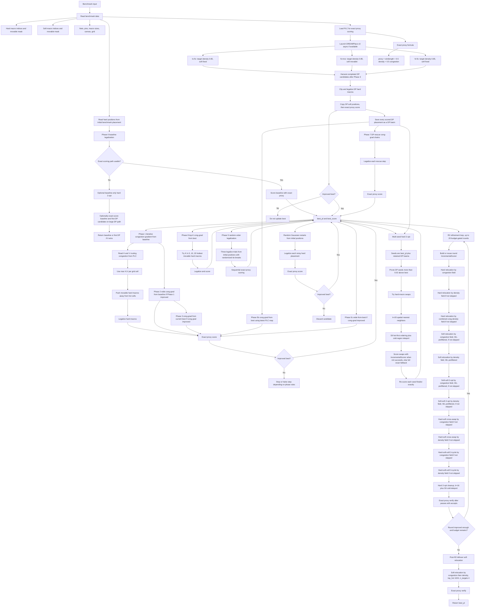

# v2 Design Flow

This document describes the production flow implemented by
`src/placer/pipeline/macro_placer.py`.



## TLDR

`MacroPlacer.place()` is a budget-gated, accept-only search over macro
placements. It launches up to three DREAMPlace subprocesses as asynchronous seed
generators, legalizes the benchmark's initial hard macro positions, and then
repeatedly creates candidate placements through congestion-gradient
perturbations, noisy restarts, alternate legalization orders, and local-search
moves.

Placement-level candidates are judged by the same exact proxy wrapper:

```text
proxy = wirelength + 0.5 * density + 0.5 * congestion
```

`best_pl` and `best_score` are the main incumbent quality state: a placement
updates them only when its exact proxy score is lower.

## Important Details

- Hard and soft macro labels come from the benchmark API. The placer does not
  infer them.
- Congestion-gradient only proposes hard-macro position perturbations. The
  proposed hard positions are then legalized and exact-scored before they can
  update `best_pl`.
- Non-DREAMPlace candidates leave soft macro positions as they are in the source
  placement. DREAMPlace candidates can carry DREAMPlace-produced soft positions.
- DREAMPlace candidates are all tested when they finish in time. The best one
  may update `best_pl`, but every scored DP candidate is also retained as a
  later 2-opt / rescue seed.
- Random-noise and random-order phases restart from the initial hard positions,
  not from `best_pl`.
- R2 is richer than "relocation plus 2-opt": each round can run hard relocation,
  soft relocation, soft-soft swaps, hard-soft swaps, hard-soft-soft 3-cycles, and
  hard 2-opt cleanup.
- R2 local passes use `IncrementalScorer` for candidate scoring when it can be
  initialized, then verify accepted pass results with `_exact_proxy`.
- The optional `V2_MULTISEED_MP` path parallelizes DP-seed 2-opt after the inline
  best-seed 2-opt. With the env var unset, seeds run sequentially in-process.
